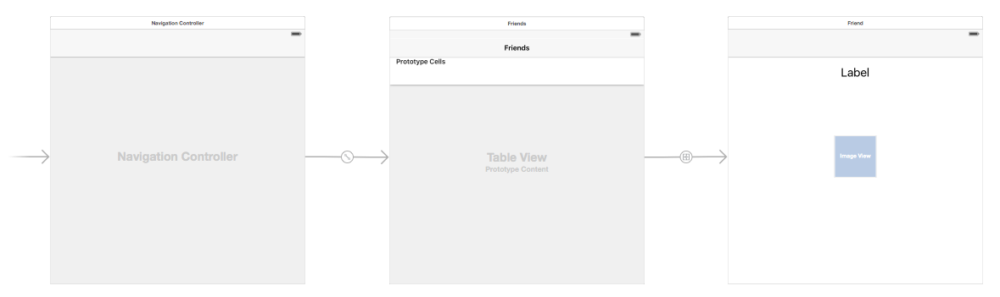
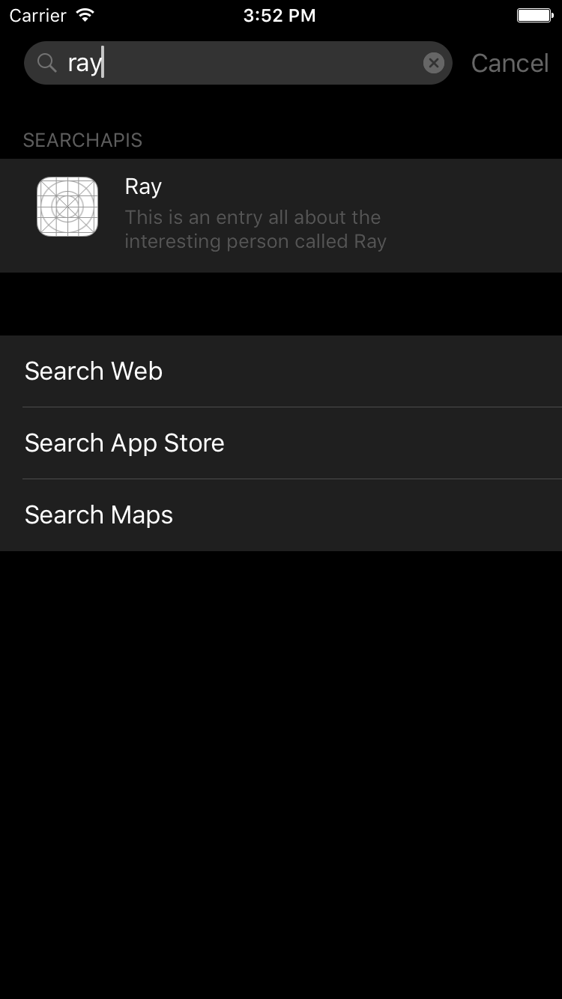

#iOS9 Day by Day
#1. Search APIs

Prior to iOS9, you could only use spotlight to find apps by their name. With the announcement of the new iOS9 Search APIs, Apple now allow developers to choose what content from their apps they want to index, as well as how the results appear in spotlight, and what happens when the user taps one of the results. 

##The 3 APIs
###NSUserActivity
The NSUserActivity API was introduced in iOS8 for Handoff, but iOS9 allows activities to be searchable. You can now provide metadata to these activities, meaning that spotlight can index them. This acts as a history stack, similar to when you are browsing the web. The user can quickly open their recent activities from Spotlight.

###Web Markup
Web Markup allows apps that mirror their content on a website to index their content in Spotlight. Users don't need to have the app installed on their device for results to appear in Spotlight. Apple's Indexer will now crawl the web looking for this particular markup in your website. This is then provided to users in both Safari and Spotlight.

The fact that results can appear even when your app is **not** installed on a user's device could lead to a lot more exposure to potential users. The deep links from your applications that you expose as public to the Search APIs will be stored in Apple's cloud index. To learn more about Web Markup, take a look at Apple's [Use Web Markup to Make App Content Searchable](https://developer.apple.com/library/prerelease/ios/releasenotes/General/WhatsNewIniOS/Articles/iOS9.html#//apple_ref/doc/uid/TP40016198-SW4) documentation.

###CoreSpotlight
CoreSpotlight is a new iOS9 framework which allows you to index any content inside of your app. While NSUserActivity is useful for saving the user's history, with this API, you can index any data you like. It essentially provides you with low level access to the CoreSpotlight index on the user's device.

##Using the Core Spotlight APIs
The NSUserActivity and Web Markup APIs are relatively simple to use, however CoreSpotlight is a little more complex. To demonstrate how the new Core Spotlight APIs work, let's create a simple app that shows a list of our friends, and then a picture of them when you tap on their name. You can [find the code on GitHub](https://github.com/shinobicontrols/iOS9-day-by-day/tree/master/01-Search-APIs) and follow along with what we are building there.

The app has a simple storyboard containing `FriendTableViewController` which displays a simple list of our friends names, and `FriendViewController` which displays details about each friend.

 
 
All of the information about our friends is stored in the `Datasource` class. This is where we create the models that store information about our friends, and also where we will include the logic to store the friends into the Core Spotlight index.

First of all, we override the `init()` method of the `Datasource` class, where we create and store an array of `Person` objects. You'll probably want to load yours from a database or from a server somewhere, but for demonstration purposes, we will simply create some dummy data.

	override init () {
		let becky = Person()
		becky.name = "Becky"
		becky.id = "1"
		becky.image = UIImage(named: "becky")!
		
		...
		
		people = [becky, ben, jane, pete, ray, tom]
	}

Once the data is stored in the `people` array, the `Datasource` is ready to use!

Now that the data is ready, the `FriendTableViewController` can create an instance of `Datasource` to use when its table view requests cells for display.

	let datasource = Datasource()
	
In the `cellForRowAtIndexPath` function, displaying the contents in the cell is as simple as:

	let person = datasource.people[indexPath.row]
	cell?.textLabel?.text = person.name 

###Saving the person entries to Core Spotlight

Now the mocked data exists, we can store it in Core Spotlight using the new APIs available in iOS 9. Back in the `Datasource` class, we have defined a function, `savePeopleToIndex`. The `FriendTableViewController` can call this function when the view has loaded.

In the function, we iterate through each person in the `people` array, creating a `CSSearchableItem` for each of them and storing them into a temporary array named `searchableItems`.

	let attributeSet = CSSearchableItemAttributeSet(itemContentType: "image" as String)
	attributeSet.title = person.name
	attributeSet.contentDescription = "This is an entry all about the interesting person called \(person.name)"
	attributeSet.thumbnailData = UIImagePNGRepresentation(person.image)
	
	let item = CSSearchableItem(uniqueIdentifier: person.id, domainIdentifier: "com.ios9daybyday.SearchAPIs.people", attributeSet: attributeSet)
	searchableItems.append(item)

The final step is to call `indexSearchableItems` on the default `CSSearchableIndex`. This actually saves the items into CoreSpotlight so that users can search for them and so they appear in search results.

	CSSearchableIndex.defaultSearchableIndex().indexSearchableItems(searchableItems, completionHandler: { error -> Void in
		if error != nil {
			print(error?.localizedDescription)
		}
	})

And that's it! When you run your application, the data will be stored. When you search in spotlight, your friends should appear!

###Responding to User Selection
Now users can see your results in Spotlight, hopefully they will tap on them! But what happens when they do? Well, at the minute, tapping a result will just open the main screen of your app. If you wish to display the friend that the user tapped on, there's a little more work involved. We can specify our app's behaviour when it is opened this way through the `continueUserActivity` `UIApplicationDelegate` method in the app's `AppDelegate`.

Here's the entire implementation of this method:

	func application(application: UIApplication, continueUserActivity userActivity: NSUserActivity, restorationHandler: ([AnyObject]?) -> Void) -> Bool {
		// Find the ID from the user info
		let friendID = userActivity.userInfo?["kCSSearchableItemActivityIdentifier"] as! String
    
		// Find the root table view controller and make it show the friend with this ID
		let navigationController = (window?.rootViewController as! UINavigationController)
		navigationController.popToRootViewControllerAnimated(false)
		let friendTableViewController = navigationController.viewControllers.first as! FriendTableViewController
		friendTableViewController.showFriend(friendID)
		
		return true
	}

As you can see, the information we previously saved into the CoreSpotlight index with the `indexSearchableItems` function is now available to us in the `userActivity.userInfo` dictionary. The only thing we are interested in for this sample is the friend ID, which was stored into the index as the item's `kCSSearchableItemActivityIdentifier`.

Once we have extracted that information from the `userInfo` dictionary, we can find the application's navigation controller, and pop to the root (without animation so it's not noticeable to the user) and then call the `showFriend` function on the `friendTableViewController`. I won't go into detail about how this works, but essentially it finds the friend with the given ID in it's datasource and then pushes a new view controller onto the navigation controller stack. That's all there is to it! Now when the user taps on a friend in spotlight, this is what they will see:

As you can see, now there is a "Back to Search" option in the top left hand corner of your app. This takes the user directly back to the search screen where they first tapped their friend's name. They can still navigate through the app with the standard back button too.

###Demo Summary
In the demo above, we've seen how easy it is to integrate your application's data with the `CoreSpotlight` index,  how powerful it can be when trying to get users to open your app, and how helpful it can be to users looking for specific content. 

We have **not** covered how to remove data from the index, however. This is important and you should always try to keep the index that your application uses up to date. For information on how to remove old entries from CoreSpotlight, take a look at the `deleteSearchableItemsWithIdentifiers`, `deleteSearchableItemsWithDomainIdentifiers` and `deleteAllSearchableItemsWithCompletionHandler` functions.

##The Importance of Good Citizenship
Although it may seem like a good idea to get as much of your content into Spotlight and Safari as possible, think twice before spamming the search indexes with your content. Being a good citizen in the iOS ecosystem is not only important to keep your customers happy, but Apple will also notice. They have clearly invested a lot into protecting relevance. Engagement ratios are tracked and spammers will be moved to the bottom of search results.

##Further Information
For more information on the new Search APIs, I'd recommend watching WWDC session 709, [Introducing Search APIs](https://developer.apple.com/videos/wwdc/2015/?id=709). You may also be interesting in reading the [NSUserActivity Class Reference](https://developer.apple.com/library/prerelease/ios/documentation/Foundation/Reference/NSUserActivity_Class/) as well as the [documentation for CoreSpotlight](https://developer.apple.com/library/prerelease/ios/releasenotes/General/WhatsNewIniOS/Articles/iOS9.html#//apple_ref/doc/uid/TP40016198-SW3).