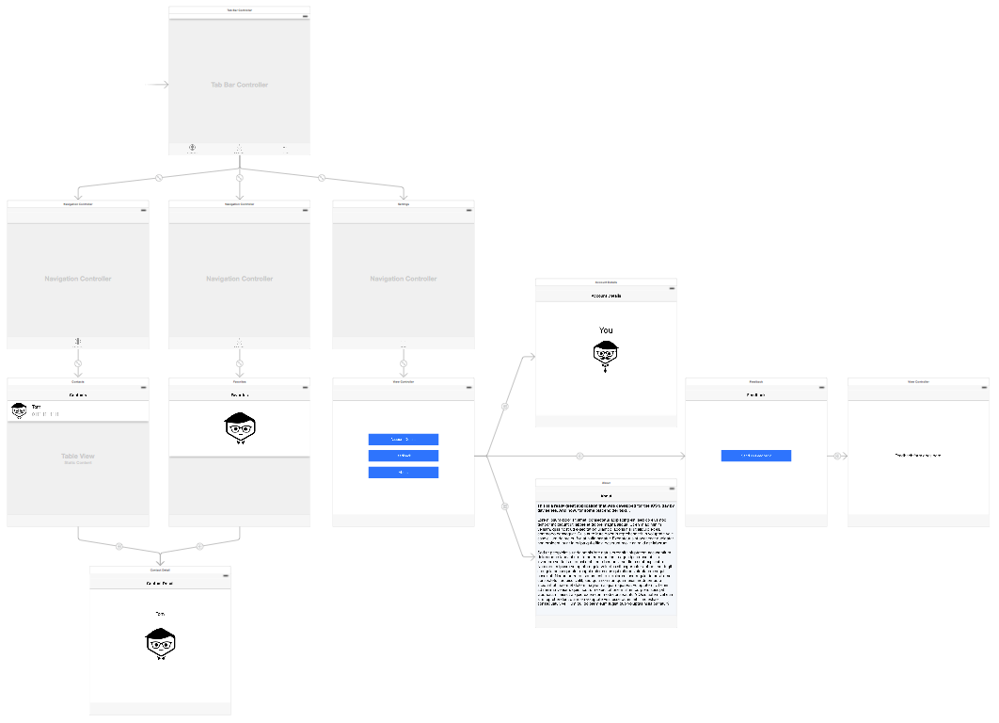
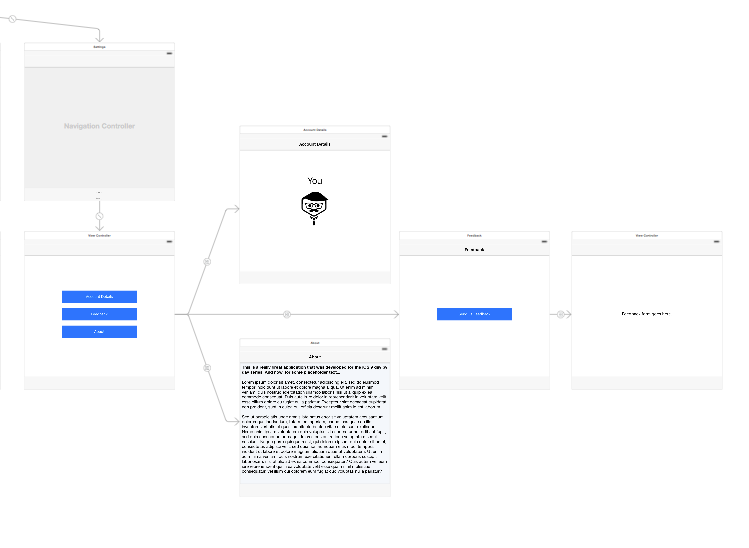
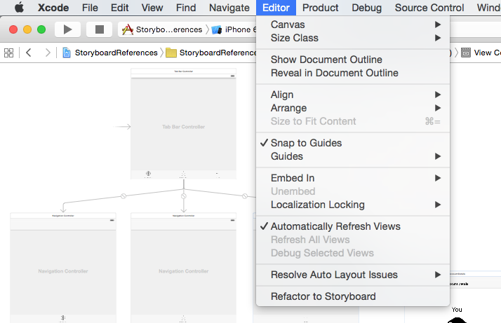
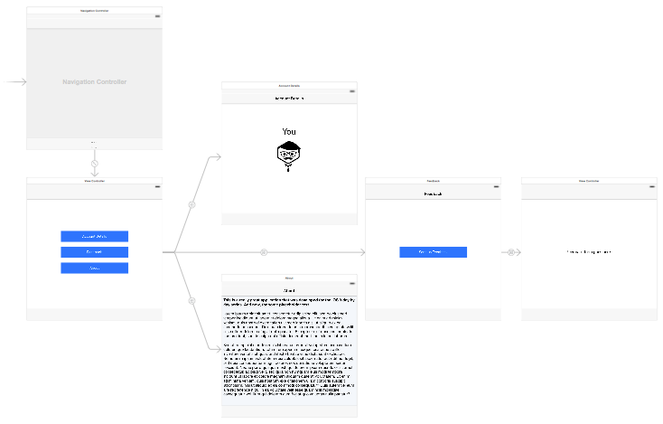
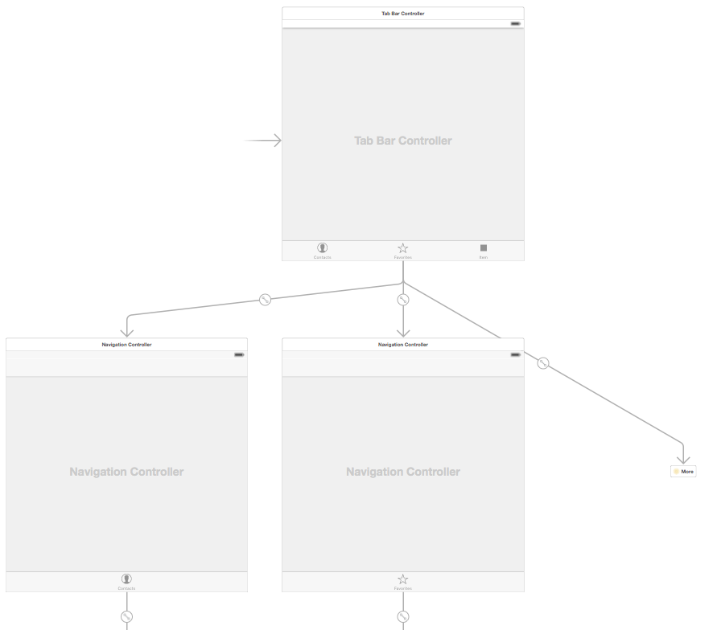
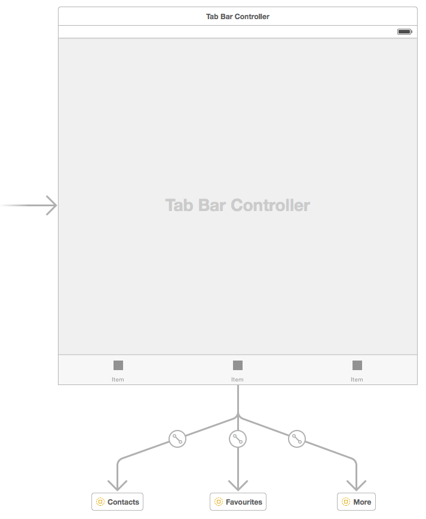
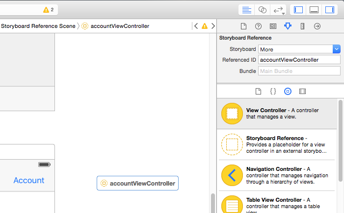
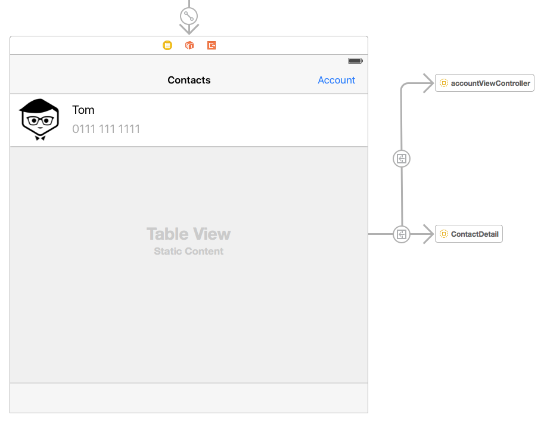

#iOS 9 Day by Day
#3. Storyboard References
If you've used interface builder to build a complicated application with a lot of screens before, you'll know how large Storyboards can become. This quickly becomes unmanageable and slows you down. Since the introduction of Storyboards, it's been possible to split different regions of your app into separate Storyboards. In the past, this involved manually creating separate Storyboard files and a considerable amount of code. 

In order to resolve this, in iOS 9 Apple have introduced the concept of Storyboard References. Storyboard References allow you to reference view controllers in other storyboards from your segues. This means that you can keep each region of your app modular, and your Storyboards become smaller and more manageable. Not only is this easier to understand, but when working in a development team it will make merges simpler.

##Simplifying A Storyboard
In order to demonstrate how Storyboard References work, lets take an existing application and try to simplify its structure. The application in question is available over at [GitHub](https://github.com/shinobicontrols/iOS9-day-by-day/tree/master/03-Storyboard-References) if you wish to follow along and then see the final result. The `OldMain.Storyboard` file is what we start with, and is included in the project for reference only. It isn't actually used any more. If you want to follow along, delete all of the storyboards in the project and rename `OldMain.Storyboard` to `Main.Storyboard`.

The screenshot below is how the original Storyboard looks.

As you can see, we are using a Tab Bar Controller as the initial view controller. This Tab Bar Controller has 3 navigation controllers, all with different root view controllers. The first one is table view controller with a list of contacts, the second is another table view controller with a list of favourite contacts. Both of these link to the same contact detail view controller. The third navigation controller contains more information about the application including account details, a feedback screen and an about screen.

Although this application is far from complicated, the Storyboard is already fairly large. I've seen Storyboards in the past with well over 10 times the number of view controllers in them, and as we all know, this quickly becomes unmanageable. Now though, we can split them up. So where should we start? In this case, we have three distinct regions. We can clearly identify these as they are the content for each section of the tab bar controller. 

We will start with the simplest case. On the right hand side of Main.storyboard you should see the view controllers that provide more information about our application. These view controllers are self contained and don't link to any common views that anything other view controllers in the application link to.

All we have to do is select these view controllers by dragging and highlighting them all. Once we have done that, select "Editor", then "Refactor to Storyboard" from Xcode's menu bar.

Give the storyboard a name of `More.storyboard` then click save. `More.storyboard` will be added to your application and opened for you.

You can see that the storyboard has been created. If you now return to `Main.storyboard`, you will see that one of the tab bar controller's view controller has changed to a Storyboard Reference.

That's great. We've managed to pull out a whole section of our UI into a separate storyboard, which not only helps with separation of concerns, but also allows us to reuse the storyboard in other areas of our app. Not particularly useful in this case, but this will be a valuable addition for many use cases.

So now we want to pull the other regions of our application out into separate storyboards. This is a little more complicated than the first step, due to the fact that both of these sections reference a common view controller. Both table views have a segue that presents the Contact Detail view controller. There are a couple of options here.

- Keep the common view controller in the Main.storyboard.
- Refactor the common view controller into it's own storyboard.

Both options will work, but my personal preference is to keep things separate. So select the Contact Detail view controller and again go to Xcode's Editor menu, selecting "Refactor to Storyboard". Give the storyboard a name and click save. That will create yet another storyboard and open it. The links to the view controller from the contacts and favourites table view controllers will be created for you.

Now go back into `Main.storyboard` and select the contacts navigation and table view controllers. Refactor those to a storyboard, then do the same for the favourites view controllers. This should be the result.

We have now split `Main.storyboard` out into 5 separate storyboard instances in the project.

- `Main.storyboard` simply contains a tab bar controller and sets the view controllers on it from the separate storyboards.
- `Contacts.storyboard` which is a navigation controller and a table view controller which when tapped links to `ContactDetail.storyboard`
- `Favorites.storyboard` which is a navigation controller and a table view controller which when tapped links to `ContactDetail.storyboard`
- `ContactDetail.storyboard` displays a single view controller that is accessed from both the contacts and the favourites storyboards.
- `More.storyboard` which contains a view controllers that show information about the app.

This restructuring has made our storyboard structure a lot more modular, which should help when developing the app further! 

### Opening a Specific View Controller from a Storyboard Reference
Until now, we have only demonstrated how to present a storyboard from a segue when we want to present the storyboard's initial view controller, and we also haven't looked at how to add a Storyboard Reference manually, without the refactoring tool.

Let's assume that we want to add a UIBarButtonItem to the top right of the Contacts table view controller which will show us more information about our account quickly, without having to go through settings.

Open `Contacts.Storyboard` and drag a UIBarButtonItem onto the table view controller's navigation bar. Change it's title to "Account". Once that is done, find the new "Storyboard Reference" object in the interface builder object reference panel. Drag that into the Contacts storyboard and then open the attributes inspector.

Select the "More" storyboard, then in the "Referenced ID" field, enter "accountViewController". This allows us to reference the account details view controller, rather than the more storyboard's initial view controller.

Once the Storyboard Reference for the account view controller is present, select the account button. Hold down Control + Click and then drag to the newly created Storyboard Reference to create a segue.

The final step is to give the account view controller the identifier we just specified. So open up `More.storyboard` and select the account view controller. Open the identity inspector and set the Storyboard ID to "accountViewController". Now when you launch the app and tap account, you should see the account view controller pushed onto the contacts navigation controller's stack.

As we have seen, adding Storyboard References (either with the refactoring tool or manually in interface builder) is simple, straightforward and effective. It allows you to create reusable components with storyboards, and helps to keep your UI modular. As ever, the results of this tutorial are [available on GitHub](https://github.com/shinobicontrols/iOS9-day-by-day/tree/master/03-Storyboard-References).

## Further Reading
For more information on Storyboard References in Xcode 7, I'd recommend watching WWDC session 215, [What's New in Storyboards](https://developer.apple.com/videos/wwdc/2015/?id=215). The first 20 minutes covers the new Storyboard Reference functionality.