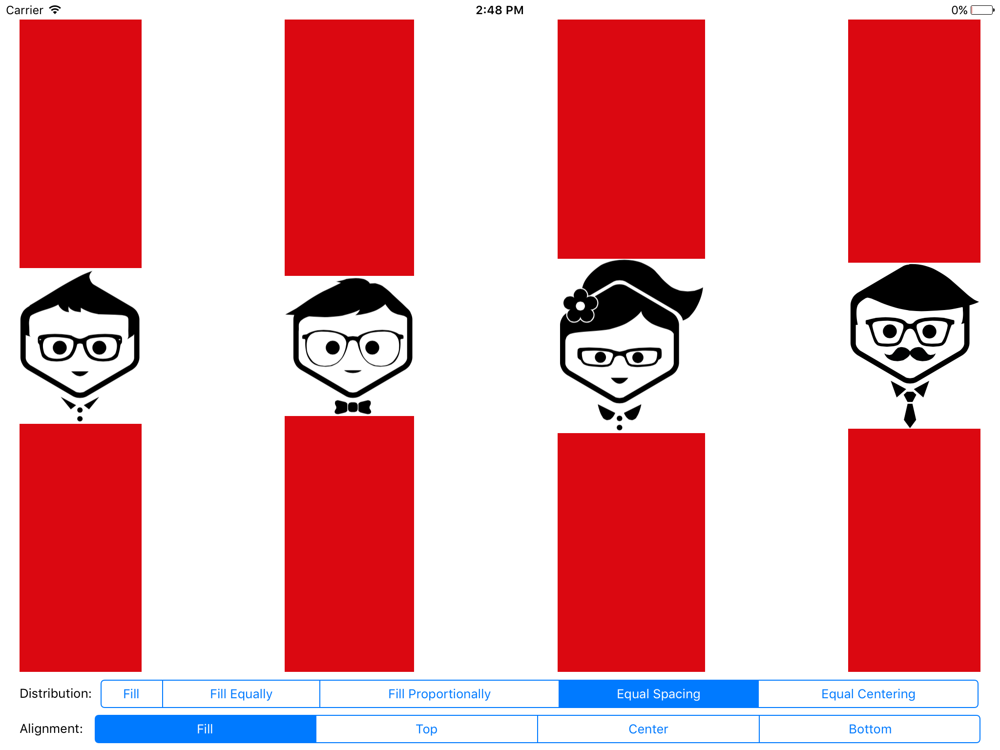
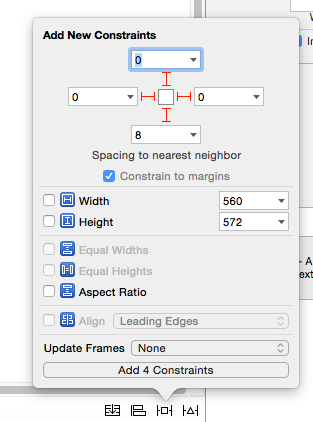
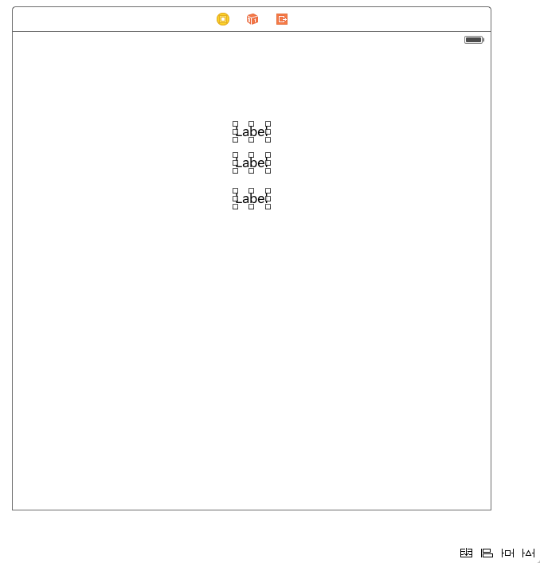

#iOS 9 Day by Day
#4. UIStackView
In iOS 9, Apple have introduced UIStackView, which gives you a simple way to horizontally or vertically stack views in your application. Under the hood, these views use auto layout to manage the position and size of their child views, which makes it easy to build adaptive UIs.

Previously, if you wished to create the kind of layout that stack views give you, you'd need a lot of constraints. You'd need to manage the layout with a lot of padding, height, and x/y position constraints depending on the orientation.

UIStackViews do all of this for you. There's even out of the box support to smoothly animate between states when adding, hiding and removing views as well as when changing the layout properties on the UIStackView itself.

##Using UIStackView
Now we are going to build an example of how to use a UIStackView. The finished code is available over at [GitHub](https://github.com/shinobicontrols/iOS9-day-by-day/tree/master/04-UIStackView), so you can follow along. We will be building a simple demonstration of how UIStackView works, which has segmented controls at the bottom to control the alignment and distribution properties of the UIStackView.

The image above is what we are going to build. As you can see, we have 4 of our friends displayed, as well as two segmented controls along the bottom. This UI uses auto layout, and adapts to any size it is given. It may therefore surprise you that when creating this, we only have to add 4 layout positioning constraints manually! 

Everything else in this view is placed with UIStackViews! In total, we have 4 UIStackViews. The first is the only one that we need to add constraints to. This is to position the stack view inside of our root view.

Once you've dragged a vertical stack view on to the view controller, open up the constraint pinning tool from the bottom right of the Interface Builder window and add the constraints specified in the screenshot above. This should keep the main stack view in the center of the view and give it the correct size.

Now drag three more horizontal stack views inside of the original vertical stack view that we just created. The stack view at the top will contain four image views; one for each of our friends. All you need to do is drag four new image views into the top stack view. Each image that we use has a slightly different size, and we don't want the images to become distorted, so on each image view, set its content mode to Aspect Fit. This means that regardless of the size of the image view, the image will always be the correct aspect ratio and will always fit inside of the image view's dimensions.

You may also notice that there are small gaps between each image view in the final implementation. This is set by the `spacing` property in interface builder's attributes inspector while the top stack view is selected. This is where you can also set the alignment and distribution properties. Leave both of these set to "Fill" for now, as we are going to modify these based on the selected segment of our segmented controls.

The other two stack views in our root stack views are also horizontal stack views. These are simple stack views, each with a label and a segmented control. Once you've added distribution and alignment labels and segmented controls, configure the controls to have the following segments:

- Distribution
	- Fill
	- Fill Equally
	- Fill Proportionally
	- Equal Spacing
	- Equal Centering
	
- Alignment
	- Fill
	- Top
	- Center
	- Bottom

We will see a visual demonstration of what each of these properties does soon, but they should be fairly self explanatory. It's worth noting that some of these properties heavily depend on the contentSizes of the contents of the stack view. Thankfully in our case this is simple, as the image size is the size of the image itself. 

Now that our UI is set up, we need to actually do something when the user selects a different segment. First, drag an IBOutlet from the top stack view which contains the image views into your view controller subclass and name it `peopleStackView`. Then, drag an IBAction from each of the segmented controls' value changed event into your class. In each function, you'll want to set the alignment or distribution property on `peopleStackView` based on which segment was selected by the user.

	@IBAction func alignmentSegmentSelected(sender: UISegmentedControl) {
        
        UIView.animateWithDuration(1.0,
            delay: 0,
            usingSpringWithDamping: 0.5,
            initialSpringVelocity: 0.2,
            options: .CurveEaseInOut,
            animations: { () -> Void in
                
                if sender.selectedSegmentIndex == 0 {
                    self.peopleStackView.alignment = .Fill
                }
                else if sender.selectedSegmentIndex == 1 {
                    self.peopleStackView.alignment = .Top
                }
                else if sender.selectedSegmentIndex == 2 {
                    self.peopleStackView.alignment = .Center
                }
                else if sender.selectedSegmentIndex == 3 {
                    self.peopleStackView.alignment = .Bottom
                }
            },
            completion: nil)
    }
    
    @IBAction func distributionSegmentSelected(sender: UISegmentedControl) {
        UIView.animateWithDuration(1.0,
            delay: 0,
            usingSpringWithDamping: 0.5,
            initialSpringVelocity: 0.2,
            options: .CurveEaseInOut,
            animations: { () -> Void in
                
                if sender.selectedSegmentIndex == 0 {
                    self.peopleStackView.distribution = .Fill
                }
                else if sender.selectedSegmentIndex == 1 {
                    self.peopleStackView.distribution = .FillEqually
                }
                else if sender.selectedSegmentIndex == 2 {
                    self.peopleStackView.distribution = .FillProportionally
                }
                else if sender.selectedSegmentIndex == 3 {
                    self.peopleStackView.distribution = .EqualSpacing
                }
                else if sender.selectedSegmentIndex == 4 {
                    self.peopleStackView.distribution = .EqualCentering
                }
            },
            completion: nil)
    }

You can see that I've wrapped the code in each function in an animation block for a bit of visual flair, but that is by no means necessary. It will instantly change if you remove the animation code. Now all that's left is to build and run!

And this should be the result!

<video width="100%" height="500" controls>
	<source src="images/StackView.mov" type="video/mp4">
	Your browser does not support the video tag.
</video>

Try playing around with the different combinations of distribution and alignment. This should show you how powerful UIStackView can be when helping you to create interfaces that work perfectly on a multitude of devices. 

### Adding existing views to UIStackView
If you have an existing UI that you wish to convert to use the UIStackView layout, simply remove the constraints on your views, select them, then click the left most button in the bottom right hand side of the Interface Builder window. This will take your views and quickly arrange them into a new UIStackView.

	
This will make converting your existing constraint based layouts into simple stack views, which handle the majority of your constraint layout for you.

## Further Reading
For more information on Storyboard References in Xcode 7, I'd recommend watching WWDC session 218, [Mysteries of Auto Layout, Part 1](https://developer.apple.com/videos/wwdc/2015/?id=215). Jason Yao covers the fundamentals of UIStackView in the first 15 minutes of the video, and creates a demo which shows how quickly you can create interfaces with fewer constraints than you needed in the past.