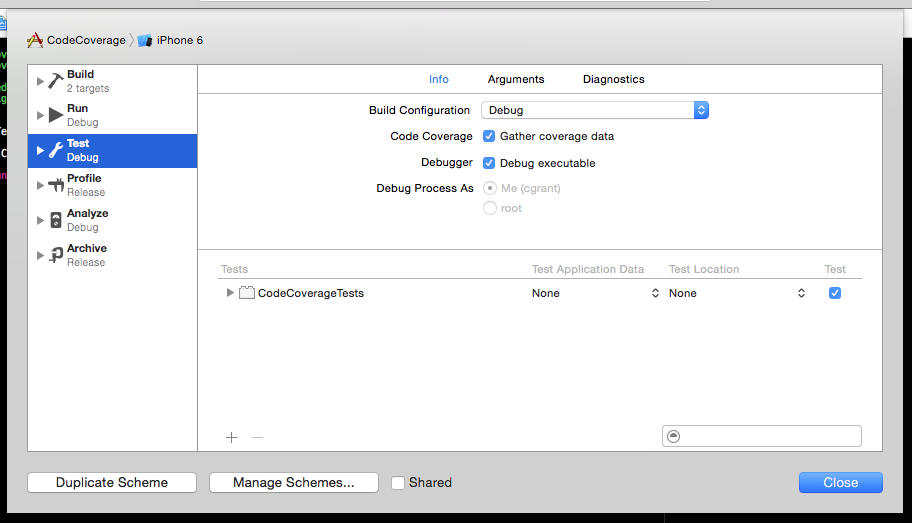
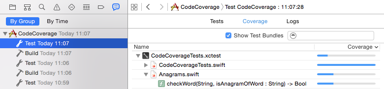
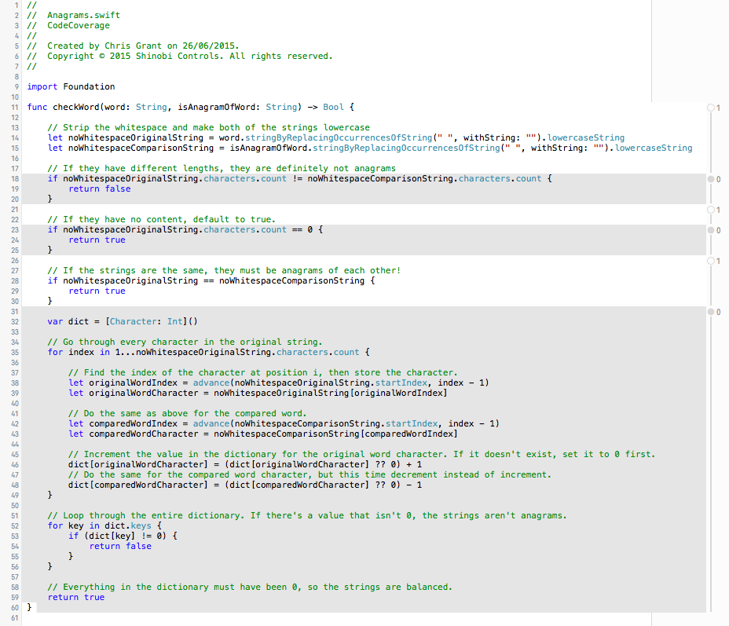
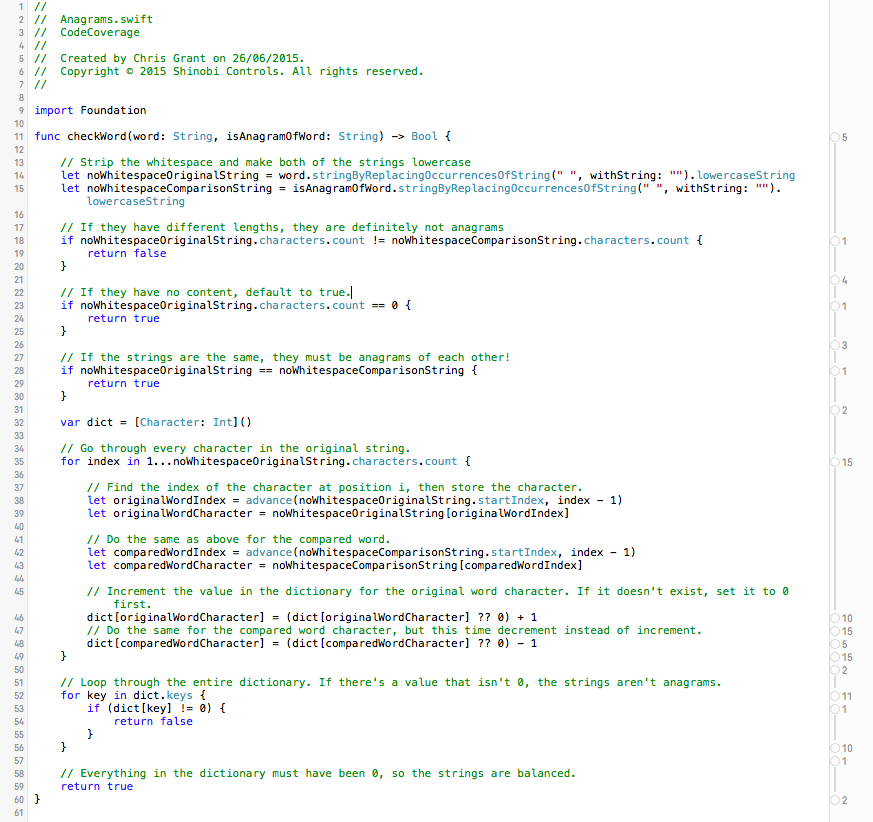

#iOS 9 Day by Day
#5. Xcode Code Coverage Tools

Code coverage is a tool that helps you to measure the value of your unit tests. High levels of code coverage give you confidence in your tests and indicate that your application has been more thoroughly tested. You could have thousands of tests, but if they only test one of your many functions, then your unit test suite isn't that valuable at all!

There's no ideal code coverage percentage that you should aim for. This will vary drastically depending your project. If your projects has a lot of visual components that you can't test, then the target figure will be a lot lower than if you're putting together a data processing framework, for example.

##Code Coverage in Xcode
In the past, if you wanted to produce code coverage reports for your projects with Xcode, there were [several](https://developer.apple.com/library/ios/qa/qa1514/_index.html) [options](http://www.cocoanetics.com/2013/10/xcode-coverage/). However, these were all fairly complicated and required a lot of manual setup. Thankfully, in iOS 9, Apple have integrated Code Coverage tools directly into Xcode itself. The tools are tightly integrated with LLVM and count each time an expression is called.

##Using the Code Coverage Tools
Now we are going to put together a simple example of how to use the new code coverage tools and how to use them to improve your existing test suite. The finished code is available over at [GitHub](https://github.com/shinobicontrols/iOS9-day-by-day/tree/master/05-CodeCoverage), so you can follow along.

The first thing to do is create a new project. Make sure that you select the option to use unit tests. This will create a default project with the required setup. Now we need something to test. This can obviously be anything you want, but I've added an empty Swift file and wrote a global function that checks whether two strings are [anagrams](https://en.wikipedia.org/wiki/Anagram) of each other. Having this as a global function probably isn't the best design, but it will do for now!

    func checkWord(word: String, isAnagramOfWord: String) -> Bool {
        
        // Strip the whitespace and make both of the strings lowercase
        let noWhitespaceOriginalString = word.stringByReplacingOccurrencesOfString(" ", withString: "").lowercaseString
        let noWhitespaceComparisonString = isAnagramOfWord.stringByReplacingOccurrencesOfString(" ", withString: "").lowercaseString
        
        // If they have different lengths, they are definitely not anagrams
        if noWhitespaceOriginalString.characters.count != noWhitespaceComparisonString.characters.count {
            return false
        }
        
        // If the strings are the same, they must be anagrams of each other!
        if noWhitespaceOriginalString == noWhitespaceComparisonString {
        	return true
        }
        
        // If they have no content, default to true.
        if noWhitespaceOriginalString.characters.count == 0 {
            return true
        }
        
        var dict = [Character: Int]()
        
        // Go through every character in the original string.
        for index in 1...noWhitespaceOriginalString.characters.count {
            
            // Find the index of the character at position i, then store the character.
            let originalWordIndex = advance(noWhitespaceOriginalString.startIndex, index - 1)
            let originalWordCharacter = noWhitespaceOriginalString[originalWordIndex]
            
            // Do the same as above for the compared word.
            let comparedWordIndex = advance(noWhitespaceComparisonString.startIndex, index - 1)
            let comparedWordCharacter = noWhitespaceComparisonString[comparedWordIndex]
            
            // Increment the value in the dictionary for the original word character. If it doesn't exist, set it to 0 first.
            dict[originalWordCharacter] = (dict[originalWordCharacter] ?? 0) + 1
            // Do the same for the compared word character, but this time decrement instead of increment.
            dict[comparedWordCharacter] = (dict[comparedWordCharacter] ?? 0) - 1
        }
        
        // Loop through the entire dictionary. If there's a value that isn't 0, the strings aren't anagrams.
        for key in dict.keys {
            if (dict[key] != 0) {
                return false
            }
        }
        
        // Everything in the dictionary must have been 0, so the strings are balanced.
        return true
    }

This is a relatively simple function, so we should be able to get 100% code coverage of it without any problems. 

Once you have added your algorithm, it's time to test it! Open up the default XCTestCase that was created for you when the project was created. Add a simple test that asserts whether "1" is an anagram of "1". Your test class should now look like this.

    class CodeCoverageTests: XCTestCase {
        
        func testEqualOneCharacterString() {
            XCTAssert(checkWord("1", isAnagramOfWord: "1"))
        }
    }

Before you run your test, we must make sure that code coverage is turned on! At the time of writing, it is off by default, so you must edit your test scheme to turn it on.

Make sure that the "Gather coverage data" box is checked, then click 'Close' and run the test target! Hopefully the test we just added will pass.

###The Coverage Tab
Once the test passes, you know that at least one route through the checkWord:isAnagramOfWord function is correct. What you don't know, is how many more there are that are not being tested. This is where the code coverage tools come in handy. If you open The code coverage tab allows you to see the different levels of code coverage in your application, grouped by target, file, then by function. 

Open the Report Navigator in Xcode's left hand pane and select the test that just build. Then on the tap bar, select "Coverage".

This will display a list of your classes and functions and indicate the test coverage levels of each. If you hover over the checkWord function, you'll see that our test only covers 28% of the class. Unacceptable! We need to find out which code paths are being executed and which aren't, so that we can improve this. Double click the function name, and XCode will open up the class with the code coverage statistics displayed alongside the code.

The white areas indicate code that is covered and has been executed. The grey areas show code that has **not** been run. These are areas where we must add more tests to check. The numbers on the right hand side show the number of times that this block of code has been executed.

###Improving Coverage
Clearly, we should be aiming for more than 28% coverage for this class. There's no UI and seems like the perfect candidate for unit testing. So lets add some more tests! Ideally, we want to reach each return statement in the function. This should give us full coverage. Add the following tests to your test class.

    func testDifferentLengthStrings() {
        XCTAssertFalse(checkWord("a", isAnagramOfWord: "bb"))
    }
    
    func testEmptyStrings() {
        XCTAssert(checkWord("", isAnagramOfWord: ""))
    }
    
    func testLongAnagram() {
        XCTAssert(checkWord("chris grant", isAnagramOfWord: "char string"))
    }
    
    func testLongInvalidAnagramWithEqualLengths() {
        XCTAssertFalse(checkWord("apple", isAnagramOfWord: "tests"))
    }
    
These tests should be enough to give us full code coverage. Run the unit tests again and head back to the code coverage tab in the latest test report.

We've done it! 100% code coverage. You can now see how the whole file has turned white and the numbers indicate that every code path has been executed at least once.

Using code coverage is a great way to help you to build a unit testing suite that is actually valuable, rather than one with lots of tests that don't really test the full functionality of your code. Xcode 7 makes this easy to do, and I'd thoroughly recommend enabling Code Coverage in your project. Even if this is on an existing test suite, it will help to give you an idea of how well tested your code is.

##Further Reading
For more information on the Code Coverage Tools in Xcode 7, I'd recommend watching WWDC session 410, [Continuous Integration and Code Coverage in Xcode](https://developer.apple.com/videos/wwdc/2015/?id=410). Don't forget, if you want to try out the project we created and described in this post, find it over at [GitHub](https://github.com/shinobicontrols/iOS9-day-by-day/tree/master/05-CodeCoverage).