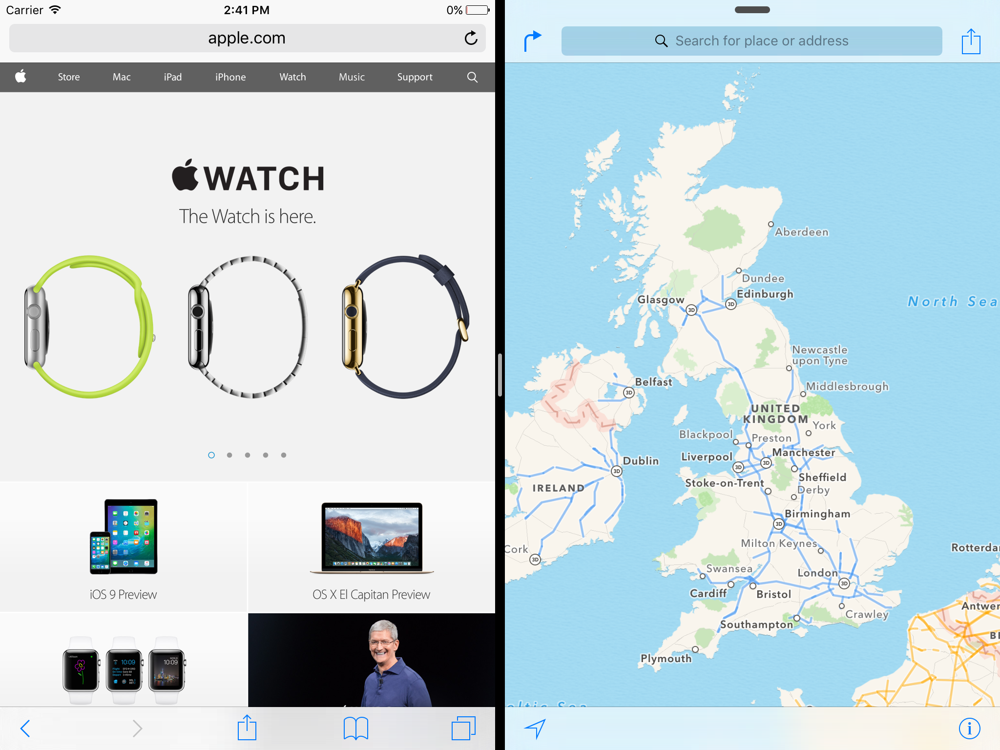
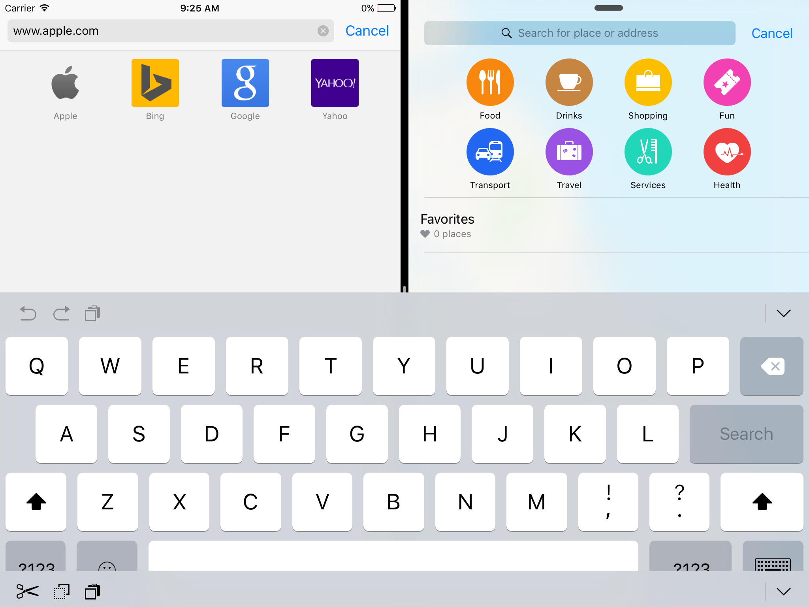

#iOS 9 Day by Day
#6. iPad Multitasking

One of the biggest changes in iOS 9 was the introduction of multitasking. Multitasking allows users to have more than one app on the screen at a time. This comes in two forms. Slide Over, and Split View. 

##Slide Over View

In slide over view, the user swipes from the right hand side to display a list of their apps, then can select one to open it in a the narrow window displayed. This appears on top of the app that was previously opened and any interaction with the left hand side of the window is disabled.

##Split View

To open split view, the user pulls the vertical divider that appears in Slide Over View further to the left. The user directly controls the size of your app's window by sliding the vertical divider between the two app windows. When split view is active, there is no concept of a foreground or background app. Both apps are in the foreground.

It's worth noting that split view is currently only available on the iPad Air 2.

##Enabling Multitasking in Your App
New Projects created in Xcode 7 have multitasking enabled by default. If you have an existing application however, you'll have to enable it manually. When you are using the iOS 9 SDK, there are a couple of steps to do this.

1. Enable all user interface orientations in your app
2. Use Launch Storyboards

###Opting Out
If your app already does the above things, then multitasking will be enabled when it is built with the iOS 9 SDK. If you want to opt out of this behaviour, specify the `UIRequiredFullscreen` key in your `info.plist ` file. 

###The Importance of Auto Layout
Auto Layout was first introduced in iOS 6, and gives you a way to lay out your UI by specifying constraints rather than fixed positions. Adaptive Layout was introduced in iOS8, which takes Auto Layout to the next level by allowing you to specify different constraints based on different size classes. Size classes identify a relative amount of display space for the height and for the width of your app's window.

Due to the nature of multitasking, there are a few issues that you'll have to take into consideration when compiling your app with the iOS 9 SDK.

###Don't Use UIInterfaceOrientation any more!
Conceptually, this doesn't work any more if your app supports multitasking. If you have a multitasking app and you are checking the current UIInterfaceOrientation, you can't be sure that your app is running in full screen. If your app is the front app in SplitView and the iPad is landscape, then even though it is larger vertically than horizontally, it will still return UIInterfaceOrientationPortrait.

Sometimes you will still need to modify your interface based on size of the app's window though. So how can we do that? The answer is to use `traitCollection.horizontalSizeClass`. This gives you the Size Class information about your interface, which you can use to conditionally position views in your app.

###Size Change Transition Events

Previously, events such as `willRotateToInterfaceOrientation` and `didRotateToInterfaceOrientation` were the recommended way to make changes to your application when the screen rotated. In iOS 8, Apple introduced `willTransitionToTraitCollection` and `viewWillTransitionToSize`. These methods become even more important in iOS 9 with the introduction of multitasking. To check whether your interface is portrait or landscape, which you still may wish to do, you can manually compare the width to the height.

###Responding to Keyboard Events

In the past, the only time your app would be effected by the keyboard was when it was opened by your app itself. Now, it's possible to have a keyboard appear on top of your app, even though a user did not open it from your app.

In some cases, you may be fine with the keyboard appearing on top of your app. However, if it obstructs an important piece of your UI then your users may be obstructed. In this situation, you should respond to one of the `UIKeyboard` notifications that have been around for a long time now. `WillShow`, `DidShow`, `WillHide`, `DidHide`, `WillChangeFrame` and `DidChangeFrame` notifications should give you the ability to do this. These events will fire in **both** apps that are present on screen.

###Other Considerations

The changes you will have to make aren't just visual. Previously, apps could rely on being the only app running in the foreground. You had sole access to the vast majority of system resources such as the CPU, GPU and memory. However, this has now changed. If a user has split view or slide over view active, and, at the same time, is watching a video in the new iOS 9 [picture in picture mode](https://developer.apple.com/library/prerelease/ios/documentation/WindowsViews/Conceptual/AdoptingMultitaskingOniPad/QuickStartForPictureInPicture.html), then these resources must be shared between three applications.

> *For best user experience, the system tightly manages resource usage and terminates apps that are using more than their fair share* - Apple iOS 9 Multitasking Documentation

You should therefore profile and heavily test your applications on different variations of iPad so that you are confident that your application is as efficient as it can be and is not using resources that it does not need.

##Further Reading
For more information on the new multitasking functionality in iOS 9, take a look at the [Adopting Multitasking On iPad](https://developer.apple.com/library/prerelease/ios/documentation/WindowsViews/Conceptual/AdoptingMultitaskingOniPad/index.html) guide in the iOS developer library. I'd also recommend watching WWDC session 205, [Continuous Integration and Code Coverage in Xcode](https://developer.apple.com/videos/wwdc/2015/?id=410). Don't forget, if you want to try out the project we created and described in this post, find it over at [GitHub](https://github.com/shinobicontrols/iOS9-day-by-day/tree/master/05-CodeCoverage).