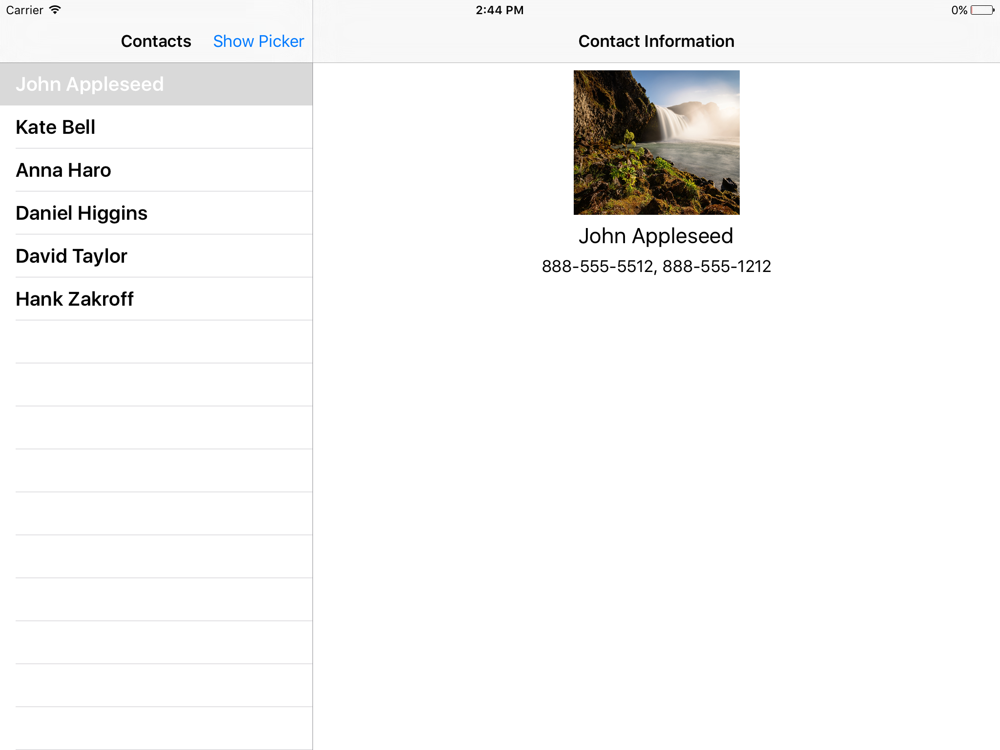
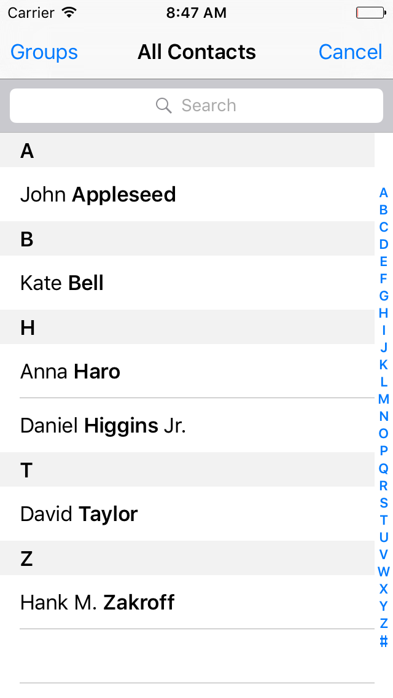
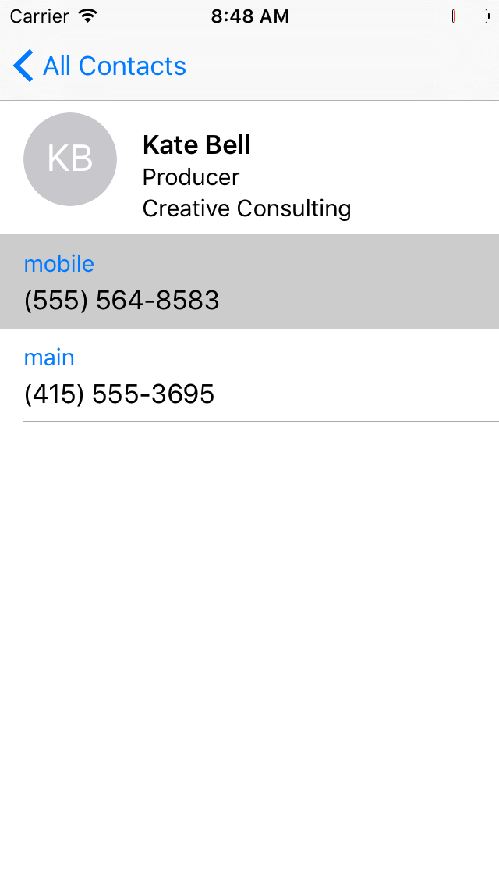

#iOS 9 Day by Day
#7. The New Contacts Framework

In iOS 9, Apple have introduced the new Contacts framework. This gives developers a way to interact with the device's contacts using an Objective-C API that works well with Swift too! This is a big improvement over the previous method of accessing a user's contacts, with the AddressBook framework. The AddressBook framework was difficult to use and did not have an Objective-C API. Using it in Swift was a huge pain point for developers and hopefully the new Contacts framework can fix this.

I think the best indicator of how much developers disliked the AddressBook framework, was the volume of the cheers in the WWDC session when it was announced that it has been deprecated in iOS 9! It was certainly one of the loudest and longest that I've heard so far.

Contacts returned from the Framework are now unified, meaning that if you have duplicate copies from different sources, they are combined into one, and that is the contact exposed to you, meaning that we no longer have to do any manual merging of contacts.

## Using the New Contacts Framework 

We are now going to build a simple application that shows you a list of your contacts and allows you to see more details about them.

As you can see, this is a master detail view controller application which also works well on the iPhone. There is a list of your device's contacts on the left hand side, and their display image, name, and phone numbers are displayed in the detail view controller.

### Fetching the User's Contacts

To get started, just set up a default Xcode project with the master detail view controller template. That should give us the views and infrastructure that we need. 

Once that is set up, open the `MasterViewController` class. First we need to import the new `Contacts` and `ContactsUI` frameworks at the top of the file.

	import Contacts
	import ContactsUI

We are now going to replace the existing datasource behavior with one which fetches and displays the current device's contacts. Let's write a function that does just that.

	func findContacts() -> [CNContact] {
	
		let store = CNContactStore()
		
`CNContactStore` is the new class to fetch and save contacts. In this article we will only be fetching contacts, but you can also use it to fetch and save contact groups, as well as contact containers.

		let keysToFetch = [CNContactFormatter.descriptorForRequiredKeysForStyle(.FullName),
			CNContactImageDataKey,
			CNContactPhoneNumbersKey]
        
		let fetchRequest = CNContactFetchRequest(keysToFetch: keysToFetch)

Once we have a reference to the store, we need to create a fetch request to query the store and fetch some results. Creating a CNContactFetchRequest, we also pass the contact keys that we wish to fetch, so we create an array of keys first. One interesting thing to note is the `CNContactFormatter.descriptorForRequiredKeysForStyle(.FullName)` key that we place in the dictionary. This is a convenience method from `CNContactFormatter`, which we will use later. `CNContactFormatter` requires many different keys, and without this `descriptorForRequiredKeysForStyle` function, we would need to specify these keys manually, like so:

	[CNContactGivenNameKey, 
	 CNContactNamePrefixKey,
	 CNContactNameSuffixKey,
	 CNContactMiddleNameKey,
	 CNContactFamilyNameKey,
	 CNContactTypeKey...]

As you can see, this is a lot of code, and if the `CNContactFormatter` key requirements were to change in future, then you'd get an exception when trying to generate a string from the `CNContactFormatter`. 

	var contacts = [CNContact]()
        
	do {
		try store.enumerateContactsWithFetchRequest(fetchRequest, usingBlock: { (let contact, let stop) -> Void in
			contacts.append(contact)
		})
	}
	catch let error as NSError {
		print(error.localizedDescription)
	} 
	
	return contacts

This code is fairly simple. All that we do is enumerate contacts from the `CNContactStore` that match our fetch request. The fetch request did not specify any queries, so it should return all contacts with all the keys that we requested. For each contact, we simply save them into a contacts array and return it.

Now we must invoke the function and use the results in our table view. Again, in `MasterViewController`, add a property to store the contacts that we want to display.
	
	var contacts = [CNContact]()

Then, update the `viewDidLoad()` function to include an asynchronous call to the contacts, and store them.

	dispatch_async(dispatch_get_global_queue(DISPATCH_QUEUE_PRIORITY_DEFAULT, 0)) {
		self.contacts = self.findContacts()
            
		dispatch_async(dispatch_get_main_queue()) {
			self.tableView!.reloadData()
		}
	}
	
Once the results have been saved, reload the table view.

You'll have to make some amendments to the `UITableViewDatasource` methods in order to display the results correctly.

	override func tableView(tableView: UITableView, numberOfRowsInSection section: Int) -> Int {
		return self.contacts.count
	}
	
	override func tableView(tableView: UITableView, cellForRowAtIndexPath indexPath: NSIndexPath) -> UITableViewCell {
		let cell = tableView.dequeueReusableCellWithIdentifier("Cell", forIndexPath: indexPath)

		let contact = contacts[indexPath.row] as CNContact
		cell.textLabel!.text = "\(contact.givenName) \(contact.familyName)"
		return cell
	}

All that's left now is to update `DetailViewController` to show the contact details. I won't go into how to do this in depth here, but you'll need an image view, a name label and a phone number label created in interface builder and stored as an IBOutlet in your `DetailViewController` class.

	@IBOutlet weak var contactImageView: UIImageView!
	@IBOutlet weak var contactNameLabel: UILabel!
	@IBOutlet weak var contactPhoneNumberLabel: UILabel!

Once that's done, we need to set the correct values. This is where we will learn how to work with `CNContact` objects. In the `configureView` function, you will need the following lines.

	label.text = CNContactFormatter.stringFromContact(contact, style: .FullName) 
	
As we discussed above, `CNContactFormatter` takes care of creating strings from a contact's name, in the correct format. All we have to do is pass in the contact and the format we require. Everything else is handled by the formatter.

When it comes to setting the image, we have to check if the imageData actually exists first. `imageData` is optional so the app could crash if the device had a contact without an image set on it.

	if contact.imageData != nil {
		imageView.image = UIImage(data: contact.imageData!)
	}
	else {
		imageView.image = nil
	}

If it does exist, then we simply create a new `UIImage` with the data and set that on the image view.

Finally, all that is left is to do is set the phone number label.

	if let phoneNumberLabel = self.contactPhoneNumberLabel {
		var numberArray = [String]()
		for number in contact.phoneNumbers {
			let phoneNumber = number.value as! CNPhoneNumber
			numberArray.append(phoneNumber.stringValue)
		}
		phoneNumberLabel.text = ", ".join(numberArray)
	}

This should be the final result. We now have an app that displays a list of the device's contacts and lets you extract data and find out more about each one.

###Using ContactsUI to Select Contact Information

Suppose we want to have an app where users can select their contacts and pass information about them to us. As we have just seen above, there is quite a lot of work involved in writing code to manually fetch and display contact information in our UI. It would be a lot simpler if something else did that for us.

This is where the ContactsUI framework comes in handy. It provides a set of view controllers that we can use to display contact information in our applications. 

In this section of the app, we want the user to be able to select one of their contacts' phone number and for us to be able to record this in the app. As this is just a demo application, add a `UIBarButtonItem` in the top right of the `MasterViewController` storyboard scene's navigation item. Then hook that up to a function with an IBAction in the `MasterViewController` class.

	@IBAction func showContactsPicker(sender: UIBarButtonItem) {
		let contactPicker = CNContactPickerViewController()
		contactPicker.delegate = self;
		contactPicker.displayedPropertyKeys = [CNContactPhoneNumbersKey]
        
		self.presentViewController(contactPicker, animated: true, completion: nil)
	}

We simply create a new `CNContactPickerViewController`, set delegate to self so we receive the responses, specify that we are only interested in phone numbers, then present the view controller to the user. Everything else is handled for us!

	func contactPicker(picker: CNContactPickerViewController, didSelectContactProperty contactProperty: CNContactProperty) {
		let contact = contactProperty.contact
		let phoneNumber = contactProperty.value as! CNPhoneNumber
        
		print(contact.givenName)
		print(phoneNumber.stringValue)
	}
	
In the contactPicker delegate function, `didSelectContactProperty`, we are passed a `CNContactProperty` object. This is a wrapper for a `CNContact` and a specific property that the user selected. Lets see how this works.

When you tap the `UIBarButtonItem` in the top right of the `MasterViewController`, you will be presented with the screen above. This is a simple list of all of your contacts, as we haven't specified a filter with a predicate on the `CNContactPickerViewController`. 

Once you tap a contact, you are presented with a list of phone numbers for that contact. No other information is visible, as we earlier specified `CNContactPhoneNumbersKey` as the only value in our contact picker's `displayedPropertyKeys`. 

Finally, when tapping a property, such as the mobile number as we have done in the screenshot above, your `contactPicker:didSelectContactProperty` function will be called before the picker is dismissed.

In this case, the contact property contains the "Kate Bell" `CNContact` as it's contact, the string "phoneNumbers" as it's key, the "5555648583" `CNPhoneNumber` as it's value, and finally the contact identifier string as it's identifier property.

In summary, we have seen that using the ContactsUI framework to select pieces of contact information is easy and quick to develop for and use. If you require more fine grained control of how your contact information is displayed, then the Contacts framework provides you with a great way to access and store contact information.

##Further Reading
For more information on the new Contacts Framework, I'd also recommend watching WWDC session 223, [Introducing the Contacts Framework for iOS and OS X](https://developer.apple.com/videos/wwdc/2015/?id=223). Don't forget, if you want to try out the project we created and described in this post, find it over at [GitHub](https://github.com/shinobicontrols/iOS9-day-by-day/tree/master/07-ContactsFramework).