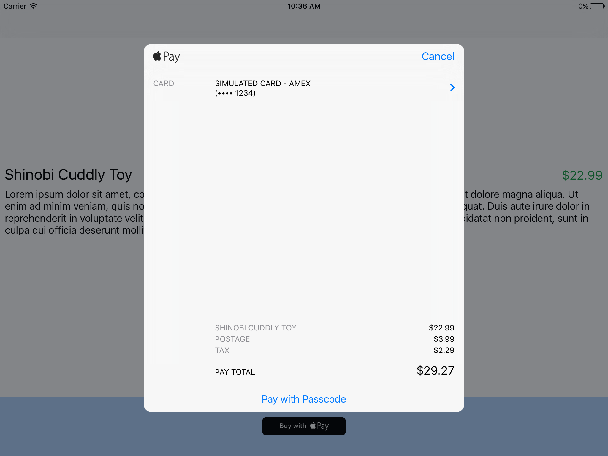
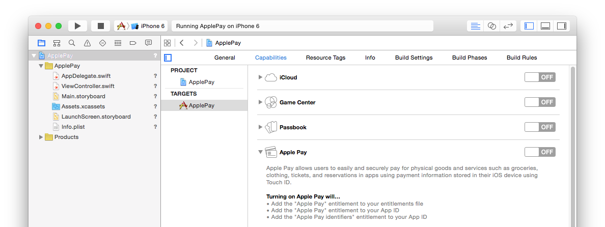
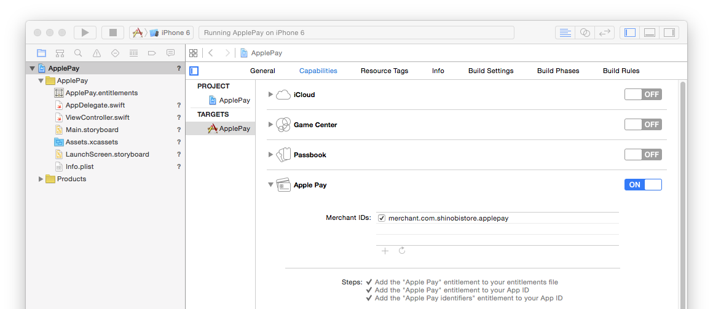
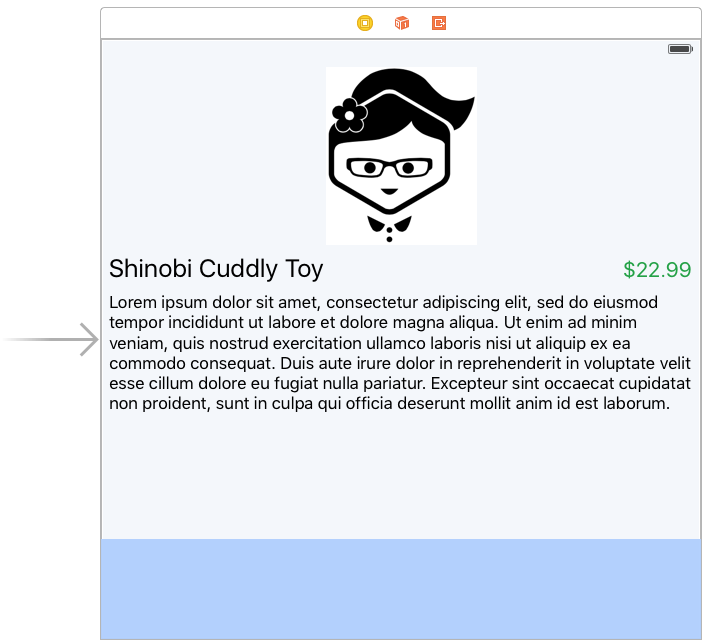
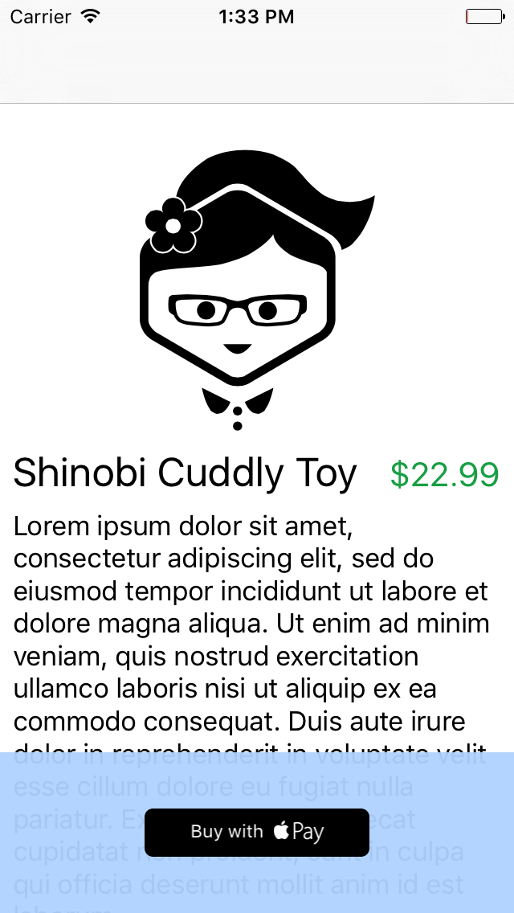
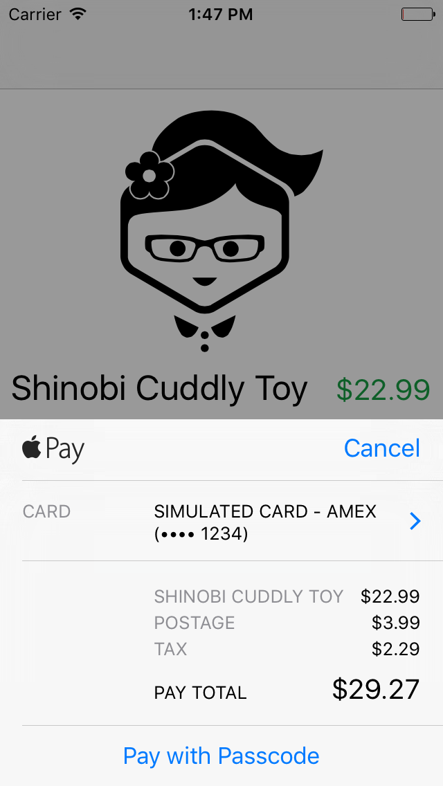
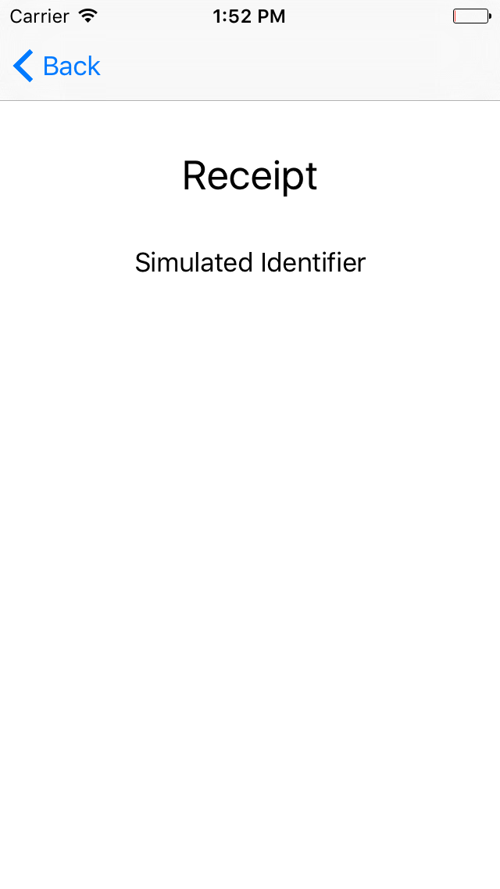

#iOS 9 Day by Day
#8. Apple Pay

Apple Pay was introduced in iOS 8, and is the easy, secure, and private way to pay for physical goods and services within apps. It makes it simple for users to pay for things by only requiring their fingerprint to authorise a transaction. 

Apple Pay is only available on certain devices. Currently, these devices are iPhone 6, iPhone 6+, iPad Air 2, and iPad mini 3. This is because Apple Pay must be supported by a dedicated hardware chip called the Secure Element, which stores and encrypts vital information.

You should **not** use Apple Pay to unlock features of your app. In App Purchase should be used in this case. Apple Pay is solely for physical goods and services, for example, club memberships, hotel reservations, and tickets for events.

##Why Use Apple Pay
Apple pay makes things a lot easier for developers. You don't need to handle and process actual card numbers any more, and you don't need users to sign up. You can remove your on boarding processes and your user doesn't need an account any more. The shipping and billing information is sent to your payment processor automatically with the Apple Pay token. This means a much easier purchase process which leads to much higher conversion rates.

In WWDC session 702, [Apple Pay Within Apps](https://developer.apple.com/videos/wwdc/2015/?id=702), Nick Shearer gave some statistics about these higher conversion rates from different businesses in the USA.

- Stubhub found that Apple Pay customers transacted **20%** more than regular customers.
- OpenTable had a **50%** transaction growth after integrating Apple Pay.
- Staples saw an increase in conversion of **109%** with Apple Pay.

##Creating a Simple Store App

We are going to set up a simple store inside of an app, and demonstrate how to use Apple Pay to process our transactions. The app will only have one product, but will be fully integrated with Apple Pay to allow us to demonstrate how to set up and get started with Apple Pay. 

This is what we are going to be building. As you can see, the user is presented with a Apple Pay sheet when they tap a buy now button.

###Enabling Apple Pay
Before we can write any code at all, we have to set up our app's capability to work with Apple Pay. Once you've created a blank new project, open the project settings, then the capabilities tab.

You should see Apple Pay listed in the capabilities section. Change the switch to the on state, and you will be asked to select a development team to use for provisioning. Hopefully, Xcode will then do all of the setup for you and Apple Pay will be enabled.

We must then add a Merchant ID, so that Apple knows how to encrypt the payment correctly. Click the add button in the Merchant ID area that appears, and enter your own, unique Merchant ID. In this example, we've chosen `merchant.com.shinobistore.appleplay`.

And that's it! You should now see that Apple Pay is enabled and you should be able to use it now in your app.
	
###Using Apple Pay

Now that we have the correct provisioning and entitlements set up, we're ready to start building the UI to allow the user to pay for our product. Open up the storyboard and and some placeholder UI to show that the product is available for sale.

The UI we have created is just a simple image with title, price, and description text. This isn't important for the demo. We do need to add a button to the view though, so lets add one at the bottom of the view. The button we are going to add is a `PKPaymentButton`. This was introduced by Apple in iOS 8.3. This Apple Pay button is localized and provides users with a standard visual indicator of when they can use Apple Pay. Using this button to launch Apple Pay screens is strongly recommended by Apple for this reason.

The button has three available styles:
	- White
    	- WhiteOutline
    	- Black

It also has two different button types:
	- Plain
	- Buy

These are just different ways to style the button. Unfortunately, adding this type of button isn't yet supported in Interface Builder, so open ViewController.swift and override the viewDidLoad method.

	override func viewDidLoad() {
		super.viewDidLoad()

		let paymentButton = PKPaymentButton(type:.Buy, style:.Black)
		paymentButton.translatesAutoresizingMaskIntoConstraints = false
		paymentButton.addTarget(self, action: "buyNowButtonTapped", forControlEvents: .TouchUpInside)
		bottomToolbar.addSubview(paymentButton)

		bottomToolbar.addConstraint(NSLayoutConstraint(item: paymentButton, attribute: .CenterX, relatedBy: .Equal, toItem: bottomToolbar, attribute: .CenterX, multiplier: 1, constant: 0))
		bottomToolbar.addConstraint(NSLayoutConstraint(item: paymentButton, attribute: .CenterY, relatedBy: .Equal, toItem: bottomToolbar, attribute: .CenterY, multiplier: 1, constant: 0))
	}

That's all we need. It's all pretty self explanatory so let's move on. Essentially, the only UI element that we really care about here is the button. We'll launch the purchase process in the `buyNowButtonTapped:` method when the button is tapped.

Once the UI has been set up, we must now process the purchase. First though, it would be good to have a solid understanding of the various classes required to make Apple Pay transactions.

####PKPaymentSummaryItem
This object is simply an item you'd like to charge for on the Apple Pay charge sheet. This could be any product, tax, or shipping, for example.

####PKPaymentRequest
A `PKPaymentRequest` combines the items you'd like to charge with how you would like to users to make the payment. This includes things such as your merchant identifier, country code and currency code etc.

####PKPaymentAuthorisationViewController
The `PKPaymentAuthorisationViewController` prompts the user to authorize a `PKPaymentRequest`, and to select a delivery address and valid payment card.

####PKPayment
A `PKPayment` contains information needed to process the payment, and the information needed to display a confirmation message.

All of these classes live under PassKit (hence the PK prefix), so you will also need to import this framework wherever you use Apple Pay.

###Setting up a Payment
The first step to setting up a payment is by creating a `PKPaymentRequest`. There's a few steps involved in doing so, which are detailed below.

	func buyNowButtonTapped(sender: UIButton) {

		// Networks that we want to accept.
		let paymentNetworks = [PKPaymentNetworkAmex,
			PKPaymentNetworkMasterCard,
			PKPaymentNetworkVisa,
			PKPaymentNetworkDiscover]

The first thing we need to do is set up an array of acceptable payment networks. This is how we will restrict or permit the certain card types that we want to accept.

		if PKPaymentAuthorizationViewController.canMakePaymentsUsingNetworks(paymentNetworks) {

Then, we have to check whether the device can process this kind of payment. The static method on `PKPaymentAuthorizationViewController`, `canMakePaymentsUsingNetworks` checks to see if the device is capable of making payments, and whether it

			let request = PKPaymentRequest()

			// This merchantIdentifier should have been created for you in Xcode when you set up the ApplePay capabilities.
			request.merchantIdentifier = "shinobistore.com.day-by-day."
			request.countryCode = "US" // Standard ISO country code. The country in which you make the charge.
			request.currencyCode = "USD" // Standard ISO currency code. Any currency you like.
			request.supportedNetworks = paymentNetworks
			request.merchantCapabilities = .Capability3DS // 3DS or EMV. Check with your payment platform or processor.

If we can process a payment on this device, then we can start to set up the payment request itself using the code above. The comments on each line should explain what effect each line has.

			// Set the items that you are charging for. The last item is the total amount you want to charge.
			let shinobiToySummaryItem = PKPaymentSummaryItem(label: "Shinobi Cuddly Toy", amount: NSDecimalNumber(double: 22.99), type: .Final)
			let shinobiPostageSummaryItem = PKPaymentSummaryItem(label: "Postage", amount: NSDecimalNumber(double: 3.99), type: .Final)
			let shinobiTaxSummaryItem = PKPaymentSummaryItem(label: "Tax", amount: NSDecimalNumber(double: 2.29), type: .Final)
			let total = PKPaymentSummaryItem(label: "Total", amount: NSDecimalNumber(double: 29.27), type: .Final)

Then, as shown above, you now have to set up the products that you want to appear on the Apple Pay sheet. These will all be used on the next line as the paymentSummaryItems on the request. 

			request.paymentSummaryItems = [shinobiToySummaryItem, shinobiPostageSummaryItem, shinobiTaxSummaryItem, total]

One interesting part of the API here is that the last item in the array is how much the user is actually charged. This wasn't obvious at first, but the Apple Pay sheet will charge the user for the amount specified in the last item. In this case, that will be total. Therefore, if you wish for more than one item to appear in the payment sheet you must calculate the total for yourself and add this to an additional `PKPaymentSummaryItem` at the end of the list, as demonstrated below.

			// Create a PKPaymentAuthorizationViewController from the request
			let authorizationViewController = PKPaymentAuthorizationViewController(paymentRequest: request)

			// Set its delegate so we know the result of the payment authorization
			authorizationViewController.delegate = self

			// Show the authorizationViewController to the user
			presentViewController(authorizationViewController, animated: true, completion: nil)
			
Finally, all that is left to do to present the Apple Pay sheet to the user is to create a `PKPaymentAuthorizationViewController` from the request, set the delegate, and present it to the user!

Now we need to make sure that we have implemented the delegate methods on `PKPaymentAuthorizationViewController`. We need to implement these methods so that we know whether a payment has been made or not, and receive callbacks when the payment has been authorized and completes.

In `paymentAuthorizationViewController:didAuthorizePayment` we need to process the payment data with our provider and then return the status to our app. The `PKPayment` object we receive in this method has a `PKPaymentToken` token property, which is what we should send to our payment provider. This is secure, encrypted data.

	
	func paymentAuthorizationViewController(controller: PKPaymentAuthorizationViewController, didAuthorizePayment payment: PKPayment, completion: (PKPaymentAuthorizationStatus) -> Void) {
		
		paymentToken = payment.token
		
		// You would typically use a payment provider such as Stripe here using payment.token
		completion(.Success)
		
		// Once the payment is successful, show the user that the purchase has been successful.
		self.performSegueWithIdentifier("purchaseConfirmed", sender: self)
	}

In `paymentAuthorizationViewControllerDidFinish`, we simply need to dismiss the view controller. 

	func paymentAuthorizationViewControllerDidFinish(controller: PKPaymentAuthorizationViewController) {
		self.dismissViewControllerAnimated(true, completion: nil)
	}
	
And that's all there is to it! Obviously in the real world you will need to send the payment token to a payment provider such as Stripe, but that's beyond the scope of this tutorial. We have also added a simple view controller to show a receipt, which in this case just shows the the payment token's `transactionIdentifier`. This is a string that describes a globally unique identifier for this transaction that can be used for receipt purposes.

##Further Reading
For more information on the Apple Pay, I'd recommend watching WWDC session 702, [Apple Pay Within Apps](https://developer.apple.com/videos/wwdc/2015/?id=702). It's quite a long session, but it's' definitely worth watching if you are interested in integrating Apple Pay with your application. There's a great section in the middle about how to improve the user experience of the payment process in your app too.

There's also a [guide to Apple Pay](https://developer.apple.com/apple-pay/) on the Apple Developer website, which contains a lot of valuable information that you should certainly be familiar with before integrating Apple Pay.

Don't forget, if you want to try out the project we created and described in this post, you can find it over at [GitHub](https://github.com/shinobicontrols/iOS9-day-by-day/tree/master/08-Apple-Pay).
