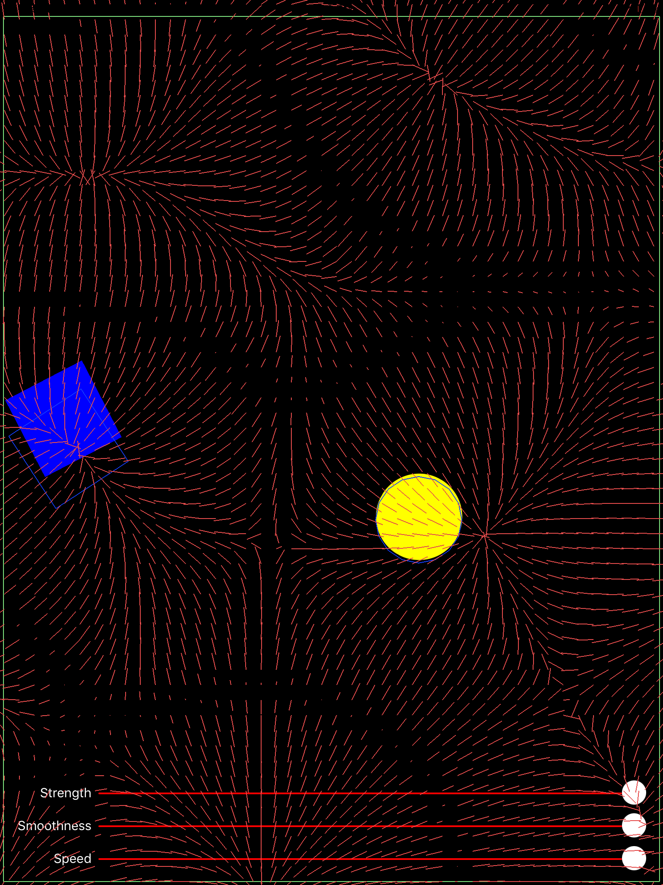
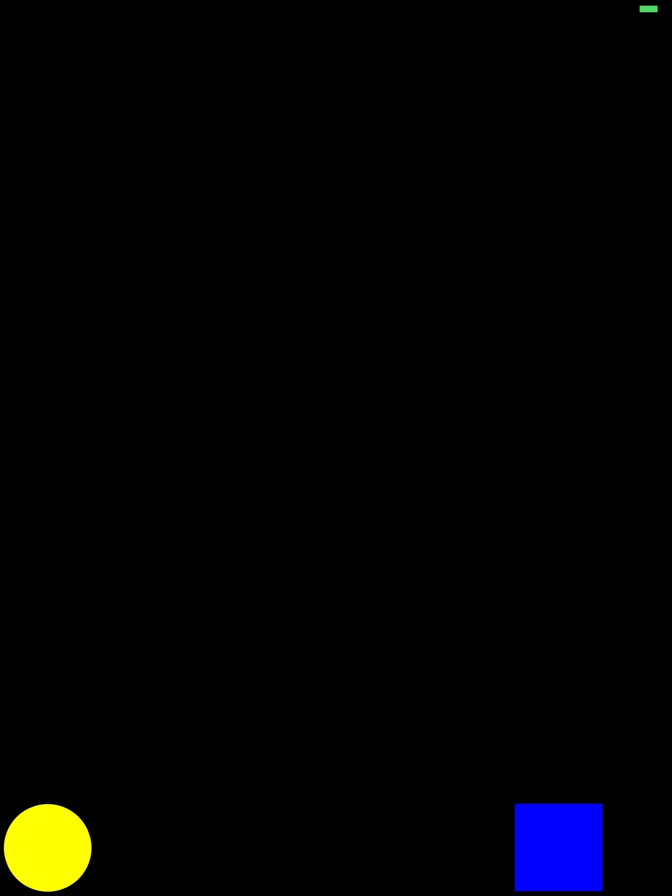
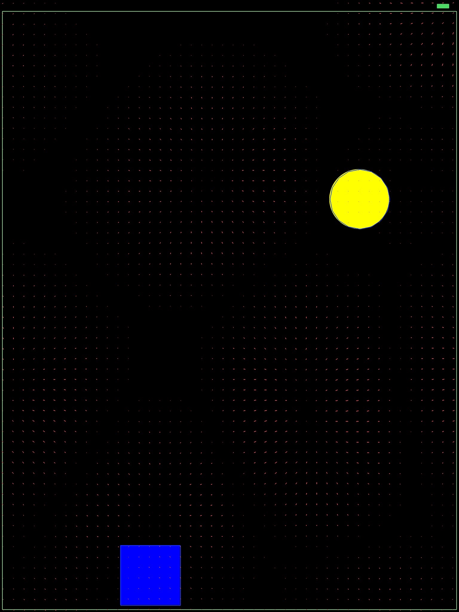
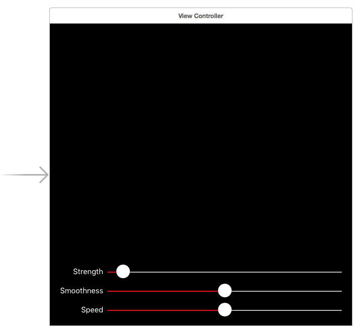

#iOS 9 Day by Day
#9. New UIKit Dynamics Features

UIKit Dynamics was introduced in iOS 7, to give developers an easy way to add some physical realism to their user interfaces. iOS 9 has brought a couple of big improvements and we are going to take a look at some of these in this post.

## Non-Rectangular Collision Bounds

Prior to iOS 9, collision bounds in UIKitDynamics could only be rectangular. This led to some strange visual effects when views collided if they were not perfectly rectangular. Now, iOS 9 supports three types of collision bound. Rectangle, Ellipse, and Path. The path can be anything, as long as it is counter clockwise and not self intersecting. There is one caveat to this though. The path **must** be convex, and not concave. 

In order to provide a custom collision bounds type, you can subclass UIView and provide your own.

	class Ellipse: UIView {
		override var collisionBoundsType: UIDynamicItemCollisionBoundsType {
			return .Ellipse
		}
	}

You can do the same if you have custom view with a custom collision bounds path too.

##UIFieldBehavior

Before iOS 9, the only type of field behaviour available was the gravity behaviour. This has been a UIFieldBehavior all along, but the API was not exposed for the user of the SDK to subclass.

Now, UIKit Dynamics contains a variety of field behaviours:

- Linear Gravity
- Radial Gravity
- Noise
- Custom

These behaviours all have a variety of properties to customise how they effect the views in the UIDynamicAnimator, and are very simple to use and add.

##Building a UIFieldBehavior & Non-Rectangular Collision Bounds Example

Lets combine these two new features into an example. We will have a couple of views, (one ellipse and one square) and add some collision logic, and a noise UIFieldBehavior.

To use UIKit Dynamics, the first thing you need to set up is a UIDynamicAnimator. Once you have set up a variable in your class to keep a reference to it, set it up in the `viewDidLoad` method.

	// Set up a UIDynamicAnimator on the view.
	animator = UIDynamicAnimator(referenceView: view)

Now we need to add some views that will actually animate.

	// Add two views to the view
	let square = UIView(frame: CGRect(x: 0, y: 0, width: 100, height: 100))
	square.backgroundColor = .blueColor()
	view.addSubview(square)
    
	let ellipse = Ellipse(frame: CGRect(x: 0, y: 100, width: 100, height: 100))
	ellipse.backgroundColor = .yellowColor()
	ellipse.layer.cornerRadius = 50
	view.addSubview(ellipse)

These are two basic views that we will add to the view's behaviors.

	let items = [square, ellipse]
    
	// Create some gravity so the items always fall towards the bottom.
	let gravity = UIGravityBehavior(items: items)
	animator.addBehavior(gravity)

The first behavior we create is a gravity behavior. 

	let noiseField:UIFieldBehavior = UIFieldBehavior.noiseFieldWithSmoothness(1.0, animationSpeed: 0.5)
	// Set up the noise field
	noiseField.addItem(square)
	noiseField.addItem(ellipse)
	noiseField.strength = 0.5
	animator.addBehavior(noiseField)
    
The next behavior we need to set up is a `UIFieldBehavior`, using the `noiseFieldWithSmoothness` initializer. We add the square and ellipse to this behavior and add the field behavior to the animator.

	// Don't let objects overlap each other - set up a collide behaviour
	let collision = UICollisionBehavior(items: items)
	collision.setTranslatesReferenceBoundsIntoBoundaryWithInsets(UIEdgeInsets(top: 20, left: 5, bottom: 5, right: 5))
	animator.addBehavior(collision)
    
We then set up a `UICollisionBehavior` for the items. This prevents them overlapping and adds collision physics to the animator. We also use `setTranslatesReferenceBoundsIntoBoundaryWithInsets`. This creates a bounding box around the view and allows us to specify some insets so the bounds are visible. If we didn't have a bounding box, then gravity would take the ellipse and square off the bottom of the screen  and they would never return!

Speaking of gravity, it would be nice if the gravity in our example always pointed toward the bottom of the device. In other words, the direction of real life gravity! In order to do this, we have to use the CoreMotion framework. Import core motion, and create a CMMotionManager variable.

	let manager:CMMotionManager = CMMotionManager()

We need a property for this because we have to keep a reference to it so we can continue to get updates. Otherwise the manager will be released and the updates will never be created. Once we start to receive device motion updates, we can update the gravity behavior's `gravityDirection` property to a vector that faces down, based on the deviceManager's `gravity` property.

	// Used to alter the gravity so it always points down.
	if manager.deviceMotionAvailable {
		manager.deviceMotionUpdateInterval = 0.1
		manager.startDeviceMotionUpdatesToQueue(NSOperationQueue.mainQueue(), withHandler:{
            deviceManager, error in
			gravity.gravityDirection = CGVector(dx: deviceManager!.gravity.x, dy: -deviceManager!.gravity.y)
		})
	}
    
Note that this will only work for the portrait orientation. You'll have to add some additional calculations if you want to support all device orientations in this app!

If you launch the app now, you'll see something like this.

The squares will be moving around, but you can't really see what is going on! In WWDC session 229, Apple revealed a way to visually debug the effects being applied by an animator. All you need to do is add a bridging header (if you are writing your project in swift), then add the following code.

	@import UIKit;

	#if DEBUG

	@interface UIDynamicAnimator (AAPLDebugInterfaceOnly)

	/// Use this property for debug purposes when testing.
	@property (nonatomic, getter=isDebugEnabled) BOOL debugEnabled;

	@end

	#endif

This exposes some private API on `UIDynamicAnimator` which turns on debug mode. This lets you see the forces that are being applied to your views. Back in your `ViewController` class, you can now set the `debugEnabled` property to true on the animator.
    
    animator.debugEnabled = true // Private API. See the bridging header.
    	
Now, when the app launches, you'll be able to see the forces that are being applied from the UIFieldBehavior.


    
You can also see bounding boxes around the view's collision bounds, and around the ellipse and square too! There are a couple of other properties you can add, which are not in the API but are available in lldb. These are `debugInterval` and `debugAnimationSpeed`. They should provide additional help when trying to debug your UIKit Dynamics animations.

We can see the field is working and applying forces to our views. If we want to tweak the properties of the field, we would usually have to set some numbers on the object, then relaunch the app to see the effect the changes had. For this type of work, it's often a lot easier to add some controls so you can do this in real time! Open up interface builder and add three `UISlider` controls. The first will control the strength, the second the smoothness, and the last, the speed. The strength slider should scale from 0-25, and the others, 0 to 1.

Once you've set them up in Interface Builder, drag their value changed actions into the `ViewController` class, and update each property accordingly.

	@IBAction func smoothnessValueChanged(sender: UISlider) {
		noiseField.smoothness = CGFloat(sender.value)
	}
    
	@IBAction func speedValueChanged(sender: UISlider) {
		noiseField.animationSpeed = CGFloat(sender.value)
	}
    
	@IBAction func strengthValueChanged(sender: UISlider) {
		noiseField.strength = CGFloat(sender.value)
	}

Now, when the app runs, you should be able to control the three properties and see what effects the different combinations have.

Hopefully this has given you a good overview of how to work with, and debug, the new UIFieldBehavior and non-rectangular collision bounds APIs in UIKit Dynamics. I'd recommend using the app we have built on a real device, otherwise you won't get the full effect of the motion sensors!

##Further Reading
For more information on the the new UIKit Dynamics features, take look at the first half of WWDC session 229, [What's New in UIKit Dynamics and Visual Effects](https://developer.apple.com/videos/wwdc/2015/?id=229). Don't forget, if you want to try out the project we created and described in this post, you can find it over at [GitHub](https://github.com/shinobicontrols/iOS9-day-by-day/tree/master/09-UIKit-Dynamics).