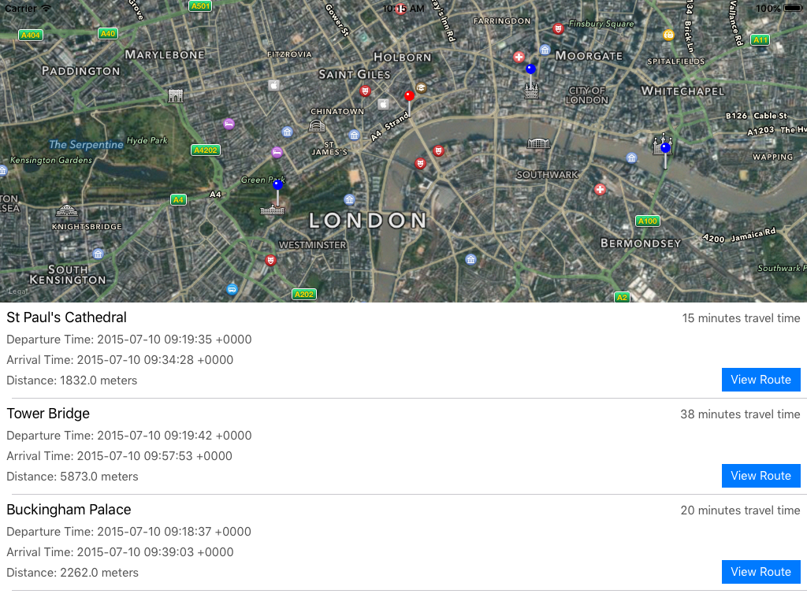
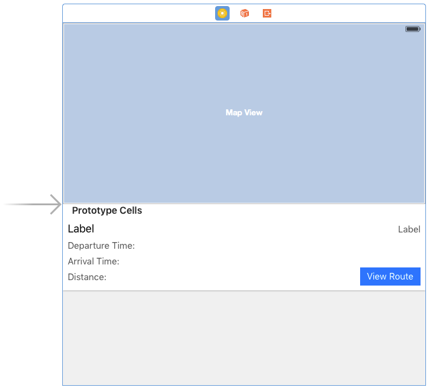
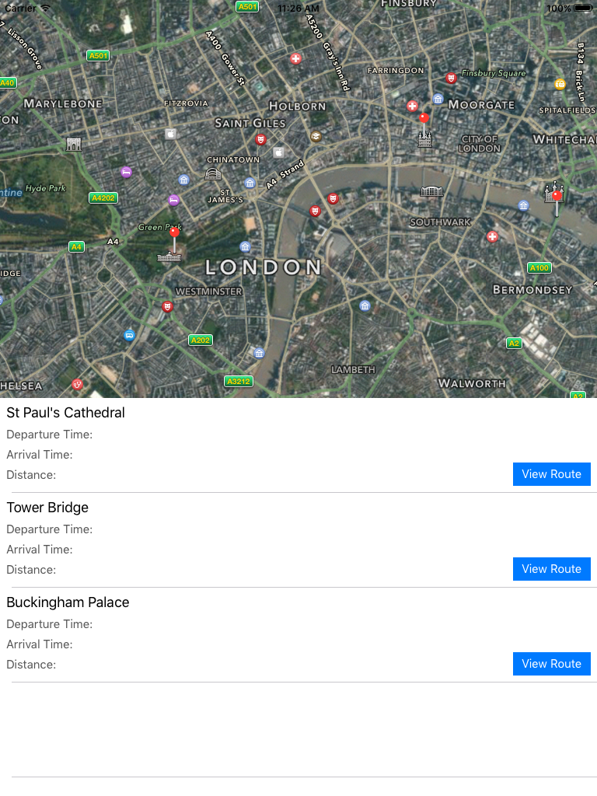

#iOS 9 Day by Day
#10. MapKit Transit ETA Requests

Each iteration of MapKit brings more and more features for developers, and the iOS 9 update was no exception. In this post we will look at some of the new MapKit APIs, and use them in an app in which we incorporate the new transit ETA functionality.

## Notable New API

### MapKit View Improvements

You can now specify more advanced callout view layouts that appear on your maps. MKAnnotation now has the following properties that you can customise:

- Title
- Subtitle
- Right Accessory View
- Left Accessory View
- Detail Callout Accessory View

Detail Callout Accessory View is new in iOS 9, and allows you to specify the detail accessory view to be used in the standard callout. This view has full auto layout and constraints support, and is a great way to customise your existing callouts.

There's also a few new, self explanatory, properties that have been added to MKMapView:

- showsTraffic
- showsScale
- showsCompass

### Transit Improvements

In iOS 9, Apple have introduced a new MKDirectionsTransportType, called MKDirectionsTransitType. Currently, this is **only** available for ETA requests, and can't be used to get a full set of directions. When you request an ETA with the `calculateETAWithCompletionHandler` function on MKDirections, you are given a MKETAResponse object in the completion handler, which contains information such as expected travel time, distance, expected arrival date, and expected departure date.

## Building a Sample App

In order to see how these new pieces of API fit together, and to try an example of the new transit ETA requests, we are going to build the following app, which shows the transit information from a tapped location, to various landmarks in London.
 

The first step is to set up your storyboard with an MKMapView, a UITableView, and the various constraints necessary to position the map view in the top half of the view, and the table view in the bottom half.

Once that is done, add a prototype table view cell and add the necessary elements. We won't go into depth about how the UI is set up because that isn't the focus of this piece, but ensure that the ViewController class acts as the UITableViewDataSource of the table view, and the MKMapViewDelegate of the map view. Once your UI is set up, you should have something that looks similar to this in your storyboard.

You'll also need a custom class for the table view cell. For now, it should just be a simple class with outlets for the labels that exist inside of the table view cell in the storyboard.

	class DestinationTableViewCell: UITableViewCell {
    
		@IBOutlet weak var nameLabel: UILabel!
		@IBOutlet weak var etaLabel: UILabel!
		@IBOutlet weak var departureTimeLabel: UILabel!
		@IBOutlet weak var arrivalTimeLabel: UILabel!
		@IBOutlet weak var distanceLabel: UILabel!
		
	}

Now that the storyboard setup is out of the way, it's time to start adding pins to the map. To do that, we will need some destinations. Create a 'Destination' class which we can use to store information about these locations.

	class Destination {
    
		let coordinate:CLLocationCoordinate2D
		private var addressDictionary:[String : AnyObject]
		let name:String
    
		init(withName placeName: String,
			latitude: CLLocationDegrees,
			longitude: CLLocationDegrees,
			address:[String:AnyObject])
		{
			name = placeName
			coordinate = CLLocationCoordinate2D(latitude: latitude, longitude: longitude)
			addressDictionary = address
		}
	}

We can then easily create the locations like so:

	let stPauls = Destination(
		withName: "St Paul's Cathedral", 
		latitude: 51.5138244, 
		longitude: -0.0983483,
		address: [
			CNPostalAddressStreetKey:"St. Paul's Churchyard",
			CNPostalAddressCityKey:"London",
			CNPostalAddressPostalCodeKey:"EC4M 8AD",
			CNPostalAddressCountryKey:"England"])
			
We can then create several of these and store them in an array so that we can display them on the map when the view loads.

In `ViewController`'s viewDidLoad() method, add the following code to add all of these destinations to the map.

	for destination in destinations {
            let annotation = MKPointAnnotation()
            annotation.coordinate = destination.coordinate
            mapView.addAnnotation(annotation)
        }

This will display them on the map. You'll also need to set the initial map region in viewDidLoad() so that the map starts in the correct position. 
	
	mapView.region = MKCoordinateRegion(
		center: CLLocationCoordinate2D(
			latitude: CLLocationDegrees(51.5074157),
			longitude: CLLocationDegrees(-0.1201011)),
		span: MKCoordinateSpan(
			latitudeDelta: CLLocationDegrees(0.025),
			longitudeDelta: CLLocationDegrees(0.025)))

Next up, we have to display the destinations in the table view.

	func tableView(tableView: UITableView, numberOfRowsInSection section: Int) -> Int {
		return destinations.count
	}
    
	func tableView(tableView: UITableView, cellForRowAtIndexPath indexPath: NSIndexPath) -> UITableViewCell {
		let cell = tableView.dequeueReusableCellWithIdentifier("destinationCell") as! DestinationTableViewCell
		cell.destination = destinations[indexPath.row]
		return cell
	}

Now run the app, and you should see that the locations specified now appear on the map, and the table view should show the names of the locations.

That's great, but we can't calculate transit directions yet, because we don't have anywhere to start from! We could use the user's location, but ideally we want to get transit directions over a realistic distance. So instead, we can detect when the user taps on the map view, and use that as the start point.

To do this we will need to add a tap gesture recogniser to the map view.

	let tap = UITapGestureRecognizer(target: self, action: "handleTap:")
	mapView.addGestureRecognizer(tap)
	
Then we can create a handleTap function which translates the tap into a map view coordinate.

	let point = gestureRecognizer.locationInView(mapView)  
	userCoordinate = mapView.convertPoint(point, toCoordinateFromView:mapView)

Once we have the coordinate we store it for later use, and then add an annotation showing the user's location, after removing any existing annotation if there is one.

	if userAnnotation != nil {
		mapView.removeAnnotation(userAnnotation!)
	}
	  
	userAnnotation = MKPointAnnotation()
	userAnnotation!.coordinate = userCoordinate!
	mapView.addAnnotation(userAnnotation!)

Finally, we have to set the location on the table view cell, as they need to update the ETA information based on the user's new location. First, we have to do this on the visible cells.

	for cell in self.tableView.visibleCells as! [DestinationTableViewCell] {
		cell.userCoordinate = userCoordinate
	}
	
but we also need to update the `tableView:cellForRowAtIndexPath` function to set the user coordinate on the cell in case any cells are reloaded. Add the following line before the cell is returned.

	cell.userCoordinate = userCoordinate
	

Whenever the user coordinate is set on the table view cell, we want to trigger an update so that the 

we can do this using the didSet call on the userCoordinate property. The first thing we want to do is clear all of the text from the labels, as the previously displayed ETA information is now irrelevant.

	var userCoordinate:CLLocationCoordinate2D? {
		didSet {
		
			etaLabel.text = ""
			departureTimeLabel.text = "Departure Time:"
			arrivalTimeLabel.text = "Arrival Time:"
			distanceLabel.text = "Distance:"
			
			guard let coordinate = userCoordinate else { return }

Now that we know that there is a user coordinate and we have a start location, we can create a `MKDirectionsRequest` object which we can use to calculate the ETA information. We set the source to be a MKMapItem initialised with the coordinate, and the destination to be the mapItem property on our Destination object. We specify that we want to request transit directions with the transportType property. Then finally, we call `calculateETAWithCompletionHandler` to request the ETA information, and update the labels based on that. 

	let request = MKDirectionsRequest()
	request.source = MKMapItem(placemark: MKPlacemark(coordinate: coordinate, addressDictionary: nil))
	request.destination = destination!.mapItem
	request.transportType = .Transit
	let directions = MKDirections(request: request)
	directions.calculateETAWithCompletionHandler { response, error -> Void in
		if let err = error {
			self.etaLabel.text = err.userInfo["NSLocalizedFailureReason"] as? String
                   return
		}

		self.etaLabel.text = "\(response!.expectedTravelTime/60) minutes travel time"
		self.departureTimeLabel.text = "Departure Time: \(response!.expectedDepartureDate)"
		self.arrivalTimeLabel.text = "Arrival Time: \(response!.expectedArrivalDate)"
		self.distanceLabel.text = "Distance: \(response!.distance) meters"
	}

Now, if you run the app, you should see something like this.

Whenever you tap on the map, the ETA information in the cells will update with the fetched information.

There's one final thing left to do. Hook up the "View Route" button in each cell to an IBAction in the custom cell class and add the following code.

	guard let mapDestination = destination else { return }
        
	let launchOptions = [MKLaunchOptionsDirectionsModeKey:MKLaunchOptionsDirectionsModeTransit]
	mapDestination.mapItem.openInMapsWithLaunchOptions(launchOptions)

This will open the destination in the maps app, and display a transit route from the user's current location.

###Customising the Pin Colors
The app is now fully functional, but it's a bit difficult to tell which pin is the user's and which display our destinations. In order to customise the pin appearance, we have to implement the `MKMapViewDelegate` protocol and set ViewController to be the map view's delegate. We can then add the following code:

	func mapView(mapView: MKMapView, viewForAnnotation annotation: MKAnnotation) -> MKAnnotationView? {
		let pin = MKPinAnnotationView(annotation: annotation, reuseIdentifier: "pin")
		pin.pinTintColor = annotation === userAnnotation ? UIColor.redColor() : UIColor.blueColor()
		return pin
	}

`pinTintColor` is a new property introduced in iOS 9 which allows you to specify the tint color of the top of the pin in the annotation. As you can see above, if the annotation passed to the `mapView:viewForAnnotation` is equal to the userAnnotation, then we make the tint color red, and otherwise make it blue. This allows us to distinguish between the user location and the destinations on the map.

##Further Reading
For more information on the the new MapKit features discussed in this post, take look at WWDC session 206, [What's New in MapKit](https://developer.apple.com/videos/wwdc/2015/?id=206). Don't forget, if you want to try out the project we created and described in this post, you can find it over at [GitHub](https://github.com/shinobicontrols/iOS9-day-by-day/tree/master/10-MapKit-Transit).