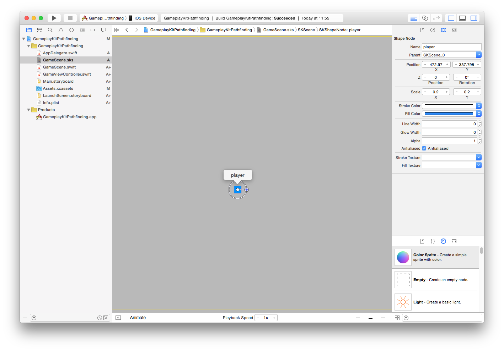
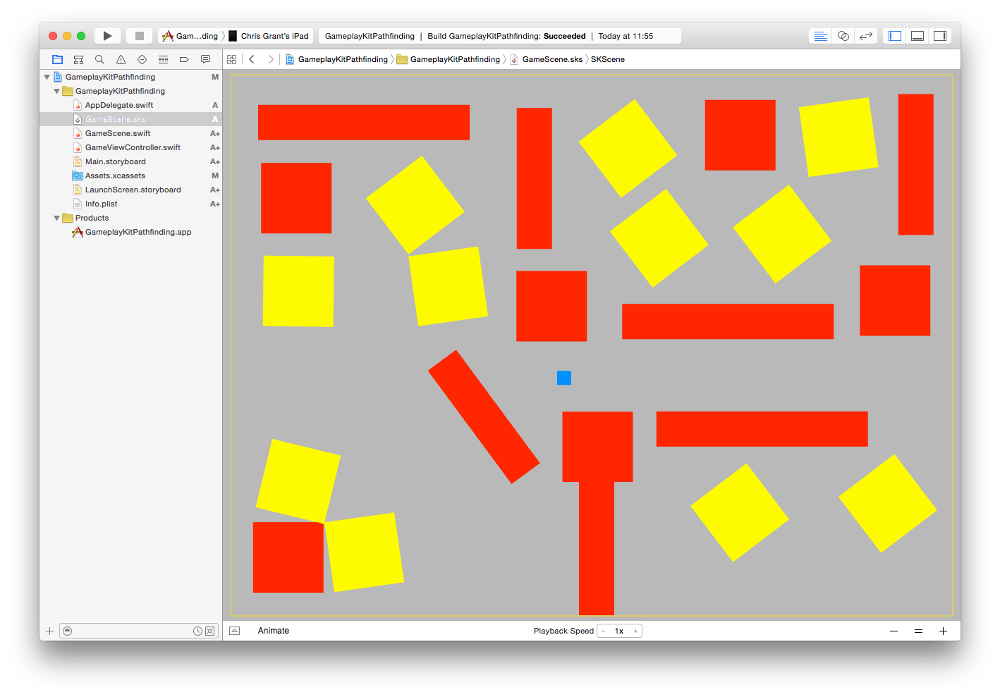

#iOS 9 Day by Day
#11. GameplayKit - Pathfinding

In previous releases of iOS, Apple have put a lot of emphasis on making it easier for developers to create games for their platforms. In iOS 7, they introduced [SpriteKit](https://developer.apple.com/library/ios/documentation/GraphicsAnimation/Conceptual/SpriteKit_PG/Introduction/Introduction.html), which is a 2D graphics and animation library that you can use to create interactive games for the iOS and OS X platforms. [SceneKit](https://developer.apple.com/library/ios/documentation/SceneKit/Reference/SceneKit_Framework/) has been available for the Mac since 2012, but at WWDC 2014, they introduced it to iOS and added a lot of new features, such as particle effects and physics simulation. 

Having worked with both in the past, I can personally testify that these frameworks are great. They are both really helpful when it comes to displaying the visual elements of your game. Having very little experience of game development, the one thing I always seemed to struggle with was how to architect games and how to model the entities and the relationships and interactions beteween them.

With the announcement of iOS 9, Apple have gone some way to try and help developers with this. They introduced a new framework, [GameplayKit](https://developer.apple.com/library/prerelease/ios/documentation/General/Conceptual/GameplayKit_Guide/), which is a collection of tools and technologies for building games in iOS and OS X. 

>Unlike high-level game engines such as SpriteKit and SceneKit, GameplayKit is not involved in animating and rendering visual content. Instead, you use GameplayKit to develop your gameplay mechanics and to design modular, scalable game architecture with minimal effort." - Apple "About GameplayKit" Prerelease Docs

The new framework includes several features:

- Randomization
- Entities and Components
- State Machines
- Pathfinding
- Agents, Goals & Behaviors
- Rule Systems

This post specifically looks at the new pathfinding functionality in the GameplayKit APIs, but future posts will explore some of the various other areas too!

##Building a Pathfinding Example

We are now going to build a simple SpriteKit example which demonstrates the new pathfinding APIs available in GameplayKit. 

First, set up a SpriteKit game project in Xcode.

This should give us a really basic template for the game we want to create. That's fine for now. The next step is to open up `GameScene.sks` and add some nodes. First, add a node that will represent the player that we want to move through the maze. 

Note that how in the property inspector on the right hand side of Xcode, the name of the node is set to "player". We will use this later to access this node.

Now we need to add nodes that the player has to avoid when moving. Otherwise this pathfinding example will be very straightforward!

Drag some nodes into the scene using the scene editor in Xcode, and you should see something similar to the above image. You can make your maze simpler, or more complicated. The important part is that there are at least a few nodes that the player has to avoid when making its way to a particular point in the scene. You don't need to set any special properties on these nodes. It's fine to leave them as basic shape nodes.

The next step is to open `GameScene.swift` and override the `touchesBegan` method. We will use the location that the touch occured as the end point for our path.

	// Whenever a tap is detected, move the player to that position.
	override func touchesBegan(touches: Set<UITouch>, withEvent event: UIEvent?) {
		for touch: AnyObject in touches {
			let location = (touch as! UITouch).locationInNode(self)
			self.movePlayerToLocation(location)
		}
	}

Once we have detected the user's tap, we can now build a path to where they tapped from the player node's current location, which avoids any obstacles along the way. For this, we will create a new function called `movePlayerToLocation`. 

	/// Moves the Player sprite through the scene to the given point, avoiding obstacles on the way.
	func movePlayerToLocation(location: CGPoint) {
		
		// Ensure the player doesn't move when they are already moving.
		guard (!moving) else {return}
		moving = true
		
The first step is to get the player. We can do this with the `childNodeWithName` function, which we pass whatever we earlier named our player node in the scene editor. 
        
        // Find the player in the scene.
        let player = self.childNodeWithName("player")
        
Once we have the player, we have to set up an array containing every other node in the scene. This will give us the obstacles that the player node will ultimately avoid.
        
        // Create an array of obstacles, which is every child node, apart from the player node.
        let obstacles = SKNode.obstaclesFromNodeBounds(self.children.filter({ (element ) -> Bool in
            return element != player
        }))
        
Once we have the obstacles, we can now use them to calculate the path from the player's current position to the position passed to this function.
        
        // Assemble a graph based on the obstacles. Provide a buffer radius so there is a bit of space between the
        // center of the player node and the edges of the obstacles.
        let graph = GKObstacleGraph(obstacles: obstacles, bufferRadius: 10)
        
        // Create a node for the user's current position, and the user's destination.
        let startNode = GKGraphNode2D(point: float2(Float(player!.position.x), Float(player!.position.y)))
        let endNode = GKGraphNode2D(point: float2(Float(location.x), Float(location.y)))
        
        // Connect the two nodes just created to graph.
        graph.connectNodeUsingObstacles(startNode)
        graph.connectNodeUsingObstacles(endNode)
        
        // Find a path from the start node to the end node using the graph.
        let path:[GKGraphNode] = graph.findPathFromNode(startNode, toNode: endNode)
        
        // If the path has 0 nodes, then a path could not be found, so return.
        guard path.count > 0 else { moving = false; return }
        
Now that the path has been derived, avoiding any obstacles along the way, the player node can be directed along the path. It's possible to create an action using `SKAction.followPath(path: CGPath, speed: CGFloat)`, but in this case I've chosen to show each step of the path as a distinct step, so the results of the pathfinding algorithm are more obvious. In a real game though, you will probably want to use `SKAction.followPath`.

The following code creates a `moveTo` `SKAction` for each gap in the path, then assembles them into a sequence and performs the action on the player node. 
        
        // Create an array of actions that the player node can use to follow the path.
        var actions = [SKAction]()
        
        for node:GKGraphNode in path {
            if let point2d = node as? GKGraphNode2D {
                let point = CGPoint(x: CGFloat(point2d.position.x), y: CGFloat(point2d.position.y))
                let action = SKAction.moveTo(point, duration: 1.0)
                actions.append(action)
            }
        }
        
        // Convert those actions into a sequence action, then run it on the player node.
        let sequence = SKAction.sequence(actions)
        player?.runAction(sequence, completion: { () -> Void in
            // When the action completes, allow the player to move again.
            self.moving = false
        })
    }
    
Now, when you tap anywhere in the scene, your player node should move to that point while avoiding all of the other nodes in the scene! If you tap in the center of a node, or somewhere that the player node can't possibly reach, then the node won't move at all.

###The Result
The video below shows the result. Notice how the player moves around the obstacles and makes it's way from it's current position to the far side of the scene.

<video width="100%" height="500" controls>
	<source src="images/PathfindingComplete.mov" type="video/mp4">
	Your browser does not support the video tag.
</video>

This was a very brief overview of the new pathfinding features. Learning how to integrate them with the rest of the functionality in GameplayKit will be key when developing a game, and that's something that we will potentially discuss in a later post!

##Further Reading
For more information on the the new GameplayKit features discussed in this post, take look at WWDC session 608, [Introducing GameplayKit](https://developer.apple.com/videos/wwdc/2015/?id=608). Don't forget, if you want to try out the project we created and described in this post, you can find it over at [GitHub](https://github.com/shinobicontrols/iOS9-day-by-day/tree/master/11-GameplayKit-Pathfinding).

If you have any questions or comments then we would love to hear your feedback. Send me a tweet [@christhegrant](http://twitter.com/christhegrant) or you can follow [@shinobicontrols](http://twitter.com/shinobicontrols) to get the latest news and updates to the iOS9 Day-by-Day series!

If you've enjoyed this post, then the next post will explore the new behavior APIs in GameplayKit. So stay tuned!