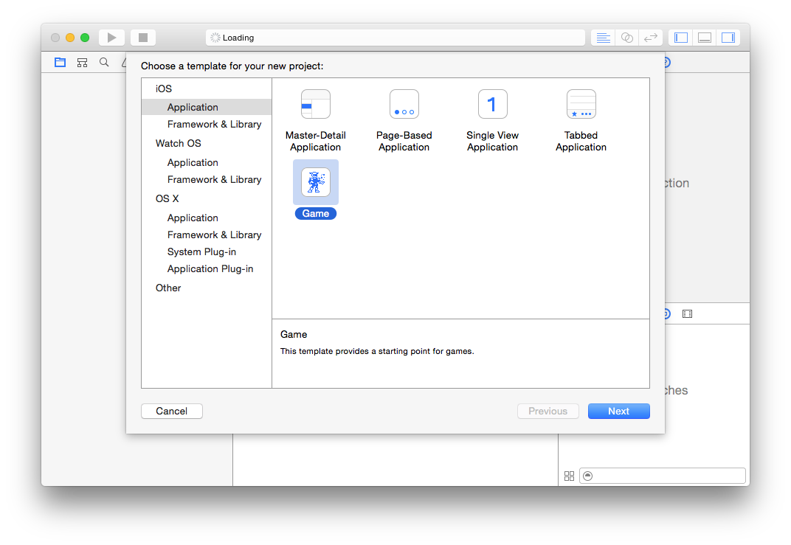

#iOS 9 Day by Day
#12. GameplayKit - Behaviors & Goals

In post 10, we looked at how you could use GameplayKit pathfinding APIs to calculate a path between two locations in your scene, while avoiding designated obstacles. 

In this post, we will take a different approach to moving nodes through our scene. Gameplay kit has introduced the concept of Behaviours and Goals, which provide you with a way to position the nodes in your scene based on constraints and desired achievements. Lets take a look at an example of how this works before looking into it in more detail.

<video width="100%" height="500" controls loop>
	<source src="images/Missile.mov" type="video/mp4">
	Your browser does not support the video tag.
</video>

In the above example (which we will build shortly), you can see a yellow box which represents the user. This box is controlled by the user moving their finger around the scene. Pretty basic stuff! The interesting part is the missile, which seeks the player, and will always try to reach the center point of the player node.

This doesn't use any physics or custom code, and is solely controlled by a simple behavior composed with a single seek goal. 

Now we know a bit about behaviours and goals work, lets take a look at how to create this demo app.

##Creating a Behavior and Goal Example

Lets walk through how to put this example together. 

Set up the default SpriteKit template and open up the GameScene.swift file.

The first thing we need to do is set up our entities. 

	let player:Player = Player()
	var missile:Missile?

A GKEntity is a general purpose object that you can add components that provide functionality to. In our case, we have two entities, one which represents the player, and another that represents the missile. We will look into how these are set up in more detail soon.

In addition to our entities, we also need to set up an array of component systems. A component system is homogeneous collection of components that will be called at the same type. We can use a lazy var here because we only want to initialize it once, when we first use it. We have a component for targeting (added to the missile node so it can target the player node) and a component for rendering (so we can render both entities in the scene). The order that we return the components defines the order that they will run in. So we return targeting then rendering, because we want to update the node positions based on the targeting component, and then render the results.

	lazy var componentSystems:[GKComponentSystem] = {
		let targetingSystem = GKComponentSystem(componentClass: TargetingComponent.self)
		let renderSystem = GKComponentSystem(componentClass: RenderComponent.self)
		return [targetingSystem, renderSystem]
	}()

But what is a GameKit Component? We have discussed the effects that it has on the entities in our scene, but not what it actually does. A GKComponent encapsulates the data and logic for a particular part of an object in an entity. Components are associated with an entity, but entities may have several components. They provide reusable pieces of behaviour that can be added to entities. This helps to prevent large inheritance trees that can become problematic with big games, by using a composition pattern.

Both of the entities in this scene have render components, and the missile entity has an additional targeting component. 

###Setting up the entities

####The Player Entity

The following is the Player class. It's a simple NodeEntity subclass which only has one component. Notice how it also has a `GKAgent2D` `agent` property.

A `GKAgent2D` is a subclass of `GKAgent`, which in turn is a subclass of `GKComponent`. `GKAgent` is a point mass whose local coordinate system is aligned to its velocity. `GKAgent2D` is a two dimensional specialisation of this class which 

	class Player: NodeEntity, GKAgentDelegate {
		let agent:GKAgent2D = GKAgent2D()

In this case, the agent is dumb. It doesn't actually do anything or effect the position of the node unless it is changed manually by user interaction. We need an agent though because the targeting component has to have an agent to use as its target.

		override init() {
			super.init()
			
In the init function, we add the RenderComponent, and add a PlayerNode to the the render component's node. We won't go into detail with the PlayerNode. It's boring and just draws a yellow box!
			
			let renderComponent = RenderComponent(entity: self)
			renderComponent.node.addChild(PlayerNode())
			addComponent(renderComponent)
        
We also have to set the delegate of the agent to self, and actually add the agent to the entity.

			agent.delegate = self
			addComponent(agent)
		}
    
We also need to implement the GKAgentDelegate functions, so that if the agent updates, the node position is updated, and if the node position updates manually, then the agent position is updated before calculations take place.

		func agentDidUpdate(agent: GKAgent) {
			if let agent2d = agent as? GKAgent2D {
				node.position = CGPoint(x: CGFloat(agent2d.position.x), y: CGFloat(agent2d.position.y))
			}
		}
    
		func agentWillUpdate(agent: GKAgent) {
			if let agent2d = agent as? GKAgent2D {
				agent2d.position = float2(Float(node.position.x), Float(node.position.y))
			}
		}
	}

####The Missile Entity

The missile entry is slightly different to the PlayerNode. In the constructor we pass a target agent which the missile will seek.

	class Missile: NodeEntity, GKAgentDelegate {
    
		let missileNode = MissileNode()
    
		required init(withTargetAgent targetAgent:GKAgent2D) {
			super.init()
        
			let renderComponent = RenderComponent(entity: self)
			renderComponent.node.addChild(missileNode)
			addComponent(renderComponent)
        
			let targetingComponent = TargetingComponent(withTargetAgent: targetAgent)
			targetingComponent.delegate = self
			addComponent(targetingComponent)
    		}
    		
You may have noticed that there's no dumb GKAgent2D in this class, which is because we use the TargetingComponent to move the entity around the scene. We will discuss the TargetingComponent below. For now, all you need to know is that we pass the targetAgent from the constructor, to the targeting component, and that will trigger the delegate methods.

In order for this to happen, then we need to implement the `agentDidUpdate` and `agentWillUpdate` delegate methods again. Note how these are different to those in the player. In this case we also have to take the zRotation into consideration in both methods.

		func agentDidUpdate(agent: GKAgent) {
			if let agent2d = agent as? GKAgent2D {
            			node.position = CGPoint(x: CGFloat(agent2d.position.x), y: CGFloat(agent2d.position.y))
            			node.zRotation = CGFloat(agent2d.rotation)
        		}
		}
    
    		func agentWillUpdate(agent: GKAgent) {
        		if let agent2d = agent as? GKAgent2D {
            			agent2d.position = float2(Float(node.position.x), Float(node.position.y))
            			agent2d.rotation = Float(node.zRotation)
			}
		}

### The Targeting Component

All of the classes so far are relatively lightweight. You'd be forgiven for thinking that the targeting component would be fully of logic and code to make things happen in our game. Fortunately though, thanks to GameplayKit, this is not the case! The entire class is only 20 lines long.

	class TargetingComponent: GKAgent2D {
    
		let target:GKAgent2D
	    
		required init(withTargetAgent targetAgent:GKAgent2D) {
	      
			target = targetAgent
	        
			super.init()

			let seek = GKGoal(toSeekAgent: targetAgent)
	        
			self.behavior = GKBehavior(goals: [seek], andWeights: [1])
	        
			self.maxSpeed = 4000
			self.maxAcceleration = 4000
			self.mass = 0.4
		}
	}

The code is so simple that there's not much to explain, but you can see that the class is a subclass of `GKAgent2D`, and creates a `GKGoal` with the `toSeekAgent` constructor. This goal is then used to create a `GKBehavior` object. If you had multiple goals here, such as to seek a certain target but to avoid another, then you could pass multiple goals into the constructor. You can also specify weights for each goal, so if avoiding one agent is more important than seeking another, you can represent that here.

We also set a few values at the bottom, `maxSpeed`, `maxAcceleration` and `mass`. These units are dimensionless but related. They will depend on your exact scenario. It took me a while to get these right. At first I thought nothing was happening and spent ages trying to find where I'd gone wrong. It turned out that these values were all set to their default values, and my missile node was moving, but really really slowly!

### The Missile Node

Now that the Missile entity is set up, we need to create a node to visually represent it in the scene. This node is just a SKNode subclass, which has a single function.

	func setupEmitters(withTargetScene scene:SKScene) {
		let smoke = NSKeyedUnarchiver.unarchiveObjectWithFile(NSBundle.mainBundle().pathForResource("MissileSmoke", ofType:"sks")!) as! SKEmitterNode
		smoke.targetNode = scene
		self.addChild(smoke)
        
		let fire = NSKeyedUnarchiver.unarchiveObjectWithFile(NSBundle.mainBundle().pathForResource("MissileFire", ofType:"sks")!) as! SKEmitterNode
		fire.targetNode = scene
		self.addChild(fire)
	}

As you can see, the setupEmitters function takes the scene object and creates two SKEmitter nodes, adding them to the node itself, and setting the target node of the emitters to the scene. If we didn't set the target node, then the particles emitted would just stay with the missile, and appear to not move through the scene! These two emitters are set up as .sks files in the project. `MissileFire.sks` and `MissileSmoke.sks` if you want to take a look. We won't go into detail here.

###Combining the Parts

Now that our nodes, entities and components are all set up, lets go back to `GameScene.swift` and put it all together! We will need to override `didMoveToView`.

	override func didMoveToView(view: SKView) {
		super.didMoveToView(view)
        

We have already set up the player during initialisation, so we can simply add player.node to the scene.

		self.addChild(player.node)
        
For the missile, we have to set it up in this method, as we have to set the player's agent as it's target.

		missile = Missile(withTargetAgent: player.agent)
		
Then we also need to pass the scene to the setupEmitters function on the missile so that the emitters leave a trail, rather than moving with the missile itself, as discussed previously.

		missile!.setupEmitters(withTargetScene: self)
		self.addChild(missile!.node)

Finally, once both of our entities are set up, we can add their components to our component systems

		for componentSystem in self.componentSystems {
			componentSystem.addComponentWithEntity(player)
			componentSystem.addComponentWithEntity(missile!)
		}

Now, in the `update:currentTime` function, all we have to do is update every component system in the componentSystems array with the delta time. This will cause the behaviors to invalidate and recalculate, then a render to trigger!

	override func update(currentTime: NSTimeInterval) {
        
		// Calculate the amount of time since `update` was last called.
		let deltaTime = currentTime - lastUpdateTimeInterval
        
		for componentSystem in componentSystems {
			componentSystem.updateWithDeltaTime(deltaTime)
		}
        
		lastUpdateTimeInterval = currentTime
	}
	
And that's all there is to it! Now, if you run the game, you should see a missile streaking towards your player. Unfortunately we haven't added collision detection and explosions, but why not build an explosion component yourself as an additional learning exercise! 

##Further Reading
For more information on the the new GameplayKit features discussed in this post, take look at WWDC session 608, [Introducing GameplayKit](https://developer.apple.com/videos/wwdc/2015/?id=608). Don't forget, if you want to try out the project we created and described in this post, you can find it over at [GitHub](https://github.com/shinobicontrols/iOS9-day-by-day/tree/master/12-GameplayKit-Behaviors).

If you've enjoyed the last two GameplayKit blog posts, then why not try and create an example that integrates pathfinding with the behavior and goal APIs discussed in this post.

If you have any questions or comments then we would love to hear your feedback. Send me a tweet [@christhegrant](http://twitter.com/christhegrant) or you can follow [@shinobicontrols](http://twitter.com/shinobicontrols) to get the latest news and updates to the iOS9 Day-by-Day series!