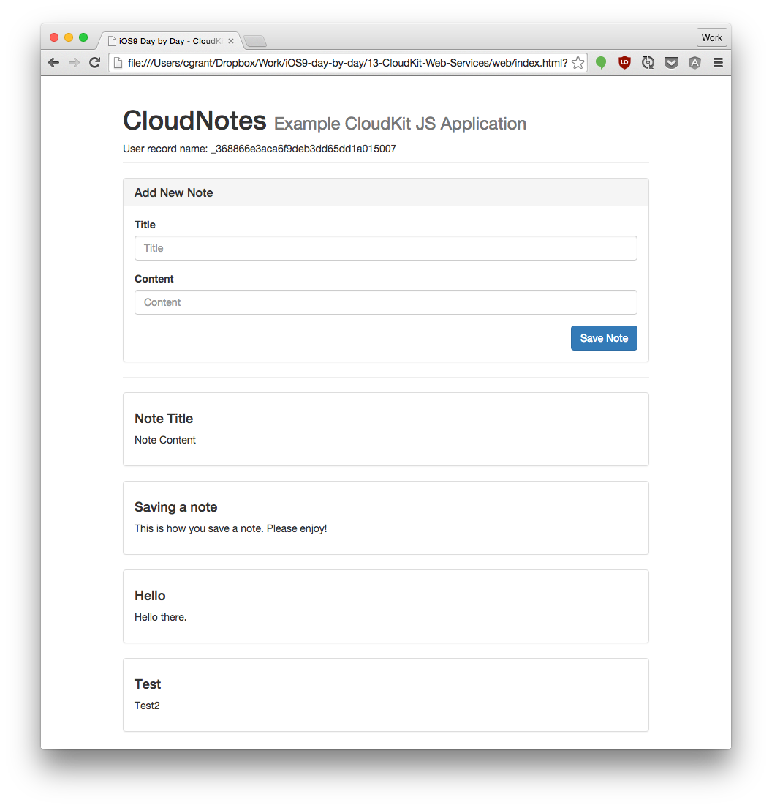
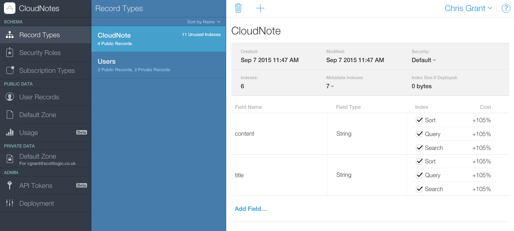
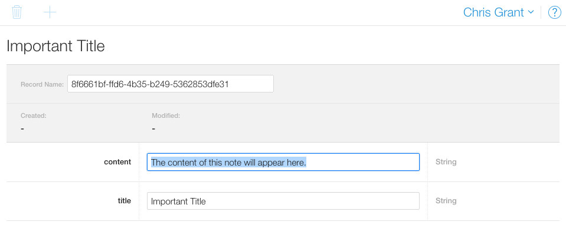
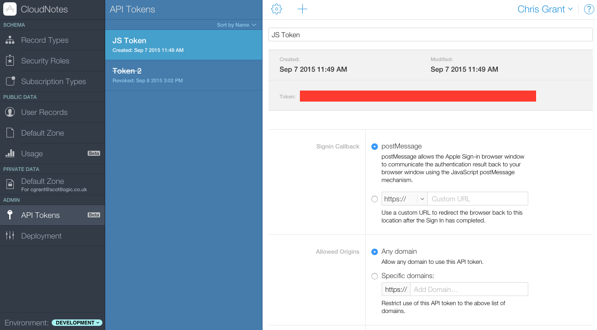
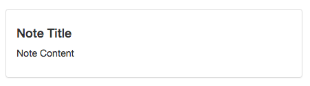
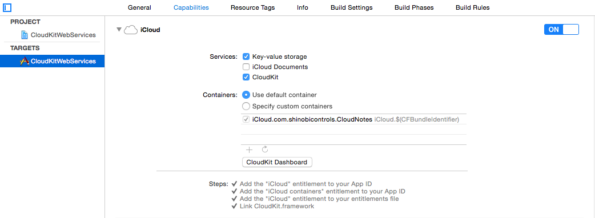

# iOS 9 Day by Day
# 13. CloudKit Web Services

CloudKit JS was introduced at WWDC 15, and allows developers to build a web interface for users to access the same containers as an existing CloudKit app. One of the major limitations of CloudKit was that the data was only accessible on iOS and OS X. Hopefully the removal of this limitations will mean that more and more developers can start to use CloudKit for their applications.

In this post, we will take a look over the features of CloudKit JS and build a sample notes application that allows users to store their important notes in the cloud!

## CloudKit JS

CloudKit JS Supports the following browsers:

- Safari
- Firefox
- Chrome
- IE
- Edge

Interestingly, it also supports node, meaning you can run requests from your own middle tier server and forward the results on to your API.

### Creating a CloudKit JS Application

In order to demonstrate the capabilities of CloudKit JS, I have built a sample application that allows you to store shared notes in CloudKit.

Lets walk through how this application was created. The first step when creating any CloudKit application, whether it is for iOS or for JS, is to open the iCloud developer dashboard. This lets you configure the details of your application, set up record types, establish security roles, enter data, and much more. You can find it at [https://icloud.developer.apple.com/dashboard](https://icloud.developer.apple.com/dashboard).

Set up a new application called CloudNotes, and just leave the settings as default for now.

Once the application is set up, we need to specify a new record type. Our application is just going to store simple notes, with a title and some content. Select the 'Record Types' option under 'Schema' on the left hand side. The 'Users' record type should already exist. That is created by default.

Click add, and create a new record type named 'CloudNote'. This is the record that we will use to store our data.

You will now be given the option to add fields. Add title and content fields (both Strings) on to the CloudNote record. That's the only structure we need for now.

Next, lets create a record so that we have something to fetch and display on our webpage. Select "Default Zone" from the left hand menu, in the "Public Data" section. All of the data we are using in this application will be public. In a real application you would probably want to store data in the private zone on a per user basis, but to keep things simple we aren't addressing security and permissions in this tutorial.

Click add and you will be given the option to enter the title and content for a new note. Then click save and your new note will be persisted into CloudKit!

Now that we have some data in our CloudKit instance, lets try and display it with some Javascript.

#### JS App Structure

Our app is only going to have one page (index.html), which will use an external JavaScript file to request and store the data from CloudKit. In order to help display the data, we are going to be using [Knockout JS](http://knockoutjs.com/). Knockout will just simplify things for us a little bit by allowing us to declare bindings between the UI and the data set that is pulled from CloudKit. It will ensure that the UI automatically refreshes when the data model's state changes. We will also import styles from bootstrap so we don't have to write any of our own CSS.

Here's the result of these imports, along with the CloudKit import too.

	<html>
	<head>
		<title>iOS9 Day by Day - CloudKit Web Services Example</title>
		<link rel="stylesheet" href="https://maxcdn.bootstrapcdn.com/bootstrap/3.3.5/css/bootstrap.min.css">
		
		
		
	</head>

Let's take a look into `cloudNotes.js` and see how we can request the data from CloudKit.

Before we can request any data, we must wait for the CloudKit API to load. We do this by placing our code in a window eventListener, which listens for the 'cloudkitloaded' event.

	window.addEventListener('cloudkitloaded', function() {

Once CloudKit has loaded, you need to configure it with your identifier, the environment, and an API token.

		CloudKit.configure({
			containers: [{
				containerIdentifier: 'iCloud.com.shinobicontrols.CloudNotes',
				apiToken: 'xxxxxxxxxxxxxxxxxxxxxxxxxxxxxxxxxxxxxxxxxxxxxxxxxxxxxxxxxxxxxxxx',
				environment: 'development'
			}]
		});

You'll have to go back into CloudKit Dashboard to generate an API token. You can do this by selecting 'API Tokens' from the 'Admin' area of CloudKit Dashboard, and clicking add. Give your API token a name, and copy and paste it into the configuration code seen in the code above.

The code in my version of `cloudNotes.js` uses [Knockout JS](http://knockoutjs.com/) to create and bind the model to the HTML. I have created a `CloudNotesViewModel` which is responsible for managing the page. It contains an array of all of the notes, as well as functions to save a new note, fetch notes from the server, display an authenticated state and display an unauthenticated state.

Before the view model can call any of these functions however, it must set up CloudKit authentication.

	container.setUpAuth().then(function(userInfo) {
		// Either a sign-in or a sign-out button will be added to the DOM here.
		if(userInfo) {
			self.gotoAuthenticatedState(userInfo);
		} else {
			self.gotoUnauthenticatedState();
		}
		self.fetchRecords(); // Records are public so we can fetch them regardless.
	});

When the promise is resolved, depending on the login state of the user, a sign-in or sign-out button will be added to the DOM. You therefore have to have a div with the id "apple-sign-in-button" on the page. This `container.setUpAuth()` function call automatically modifies this div to contain the appropriate sign in button.

#### Fetching Records

The fetch records function queries CloudKit for all of the records with the type 'CloudNote'.

	self.fetchRecords = function() {
		var query = { recordType: 'CloudNote' };

		// Execute the query.
		return publicDB.performQuery(query).then(function (response) {
			if(response.hasErrors) {
				console.error(response.errors[0]);
				return;
			}
			var records = response.records;
			var numberOfRecords = records.length;
			if (numberOfRecords === 0) {
				console.error('No matching items');
				return;
			}

			self.notes(records);
		});
	};

You can see above how to set up a basic query based on the recordType, and then execute that on the public database. Queries do not have to be executed on the public database, they can be executed on private databases too, but all of our work in this sample application is public.

Once the notes have been fetched, we store them into self.notes, which is a knockout observable. This means that the HTML will be regenerated using the note template, and the fetched notes should appear in the page.

	

		

			

				<h4></h4>
				

			

		

	

The template iterates through `notes` with a foreach binding, and prints each note's `fields.title.value` and `fields.content.value` values in a panel.

After a user has signed in, they will see the 'Add New Note' panel. The `saveNewNote` function must therefore be able to store new records into CloudKit.

	if (self.newNoteTitle().length > 0 && self.newNoteContent().length > 0) {
		self.saveButtonEnabled(false);

		var record = {
			recordType: "CloudNote",
			fields: {
				title: {
					value: self.newNoteTitle()
				},
				content: {
					value: self.newNoteContent()
				}
			}
		};

In the first half of the function, we do some basic validation to check that the record will be valid, and then create a new record based on the data that is currently in the form.

Once we have set up a new record, we are ready to save it into CloudKit.

	publicDB.saveRecord(record).then(
		function(response) {
			if (response.hasErrors) {
				console.error(response.errors[0]);
				self.saveButtonEnabled(true);
				return;
			}
			var createdRecord = response.records[0];
			self.notes.push(createdRecord);

			self.newNoteTitle("");
			self.newNoteContent("");
			self.saveButtonEnabled(true);
		}
	);

The line `publicDB.saveRecord(record)` saves the newly created record into the public database and returns a promise with the success of the save operation. The created record is pushed into the array of existing records so we don't need to refetch everything again, and then the form is cleared and the save button is enabled again.

### iOS App

To demonstrate how data can be shared between iOS and web applications using CloudKit, there's also an iOS app included in the source files for this blog post.

To set this app up, I simply created a new master detail application in Xcode.

To enable it to work with iCloud, select your project in Xcode's file explorer, select your target and then select capabilities. You should see the option to turn iCloud on. Click the switch and Xcode will communicate with the developer centre and add the entitlements required to your application.

The configuration panel should now look like this.

You're now ready to start using CloudKit in the iOS app. I won't go into the details of how it was implemented, as there's already a [comprehensive explanation of how to use CloudKit on iOS in iOS8-day-by-day](https://www.shinobicontrols.com/blog/ios8-day-by-day-day-33-cloudkit), but this is what the app should look like when you select a note. The title should be the view controller title, and the content should be displayed in the middle of the screen.

## Conclusion

Hopefully this post has shown how simple it is to use the CloudKit JS API. I'm glad that Apple now offer a web based API for CloudKit, but I still have some reservations and I don't think I'd personally use it if I were developing an application.

There are plenty of third party cloud service providers out there with more features and better documentation, as well as native SDKs for the other mobile platforms too. I also couldn't get any CloudKit services working on the simulator, no matter what I tried. That's certain to be another barrier to development if it's not fixed as soon as possible.

There are definitely use cases for CloudKit, and I'd encourage everyone to give it a try. Just think twice before developing an application where you will potentially need access to your data on other platforms in future.

## Further Reading
For more information on the the new CloudKit JS and Web Services features discussed in this post, take look at WWDC session 710, [CloudKit JS and Web Services](https://developer.apple.com/videos/wwdc/2015/?id=608). Don't forget, if you want to try out the projects we created and described in this post, you can find it over at [GitHub](https://github.com/shinobicontrols/iOS9-day-by-day/tree/master/13-CloudKit-Web-Services).

If you have any questions or comments then we would love to hear your feedback. Send me a tweet [@christhegrant](http://twitter.com/christhegrant) or you can follow [@shinobicontrols](http://twitter.com/shinobicontrols) to get the latest news and updates to the iOS9 Day-by-Day series. Thanks for reading!
